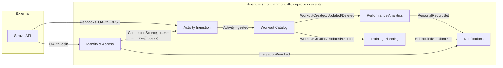

# Bounded Contexts

Aperitivo is decomposed into **six Bounded Contexts**. Each is a module in the modular monolith with its own ubiquitous language, domain model, persistence, and clear public contract (API + events).

Decomposition rationale: see [ADR 0005](../adr/0005-bounded-contexts.md). Event transport between contexts is Spring Modulith in-process events: see [ADR 0008](../adr/0008-event-transport.md).

> Style note: across all BCs, entities are plain data and services hold behavior (Spring layered). We keep DDD strategic patterns (bounded contexts, ubiquitous language, domain events) and reject the tactical rich-domain-model pattern. "Entity" below means a data record managed by a service, not a behavior-rich aggregate.

## The map

All arrows labeled with event names are Spring Modulith application events delivered in-process after commit. Arrows for OAuth/REST/webhooks are external HTTP. The IAM → Ingestion token access is a synchronous in-process call through a published interface (`TokenManager`), not an event.

## Bounded Context catalog

### 1. Identity & Access

**Responsibility:** Who is the user, how did they authenticate, and how do we hold the credentials we need to access their data on external systems.

**Owns:**
- `User` (internal UUID identity)
- `ConnectedSource` (Strava OAuth tokens, lifecycle, encryption)
- `TokenManager` (sole access point for Strava credentials)
- Strava OAuth login (Spring Security OAuth2 client) and JWT issuance (Spring Security `JwtEncoder`, RS256)
- User profile, preferences

**Language:** User, ConnectedSource, IdentityProvider, AccessToken, RefreshToken, Revocation.

**Publishes events:**
- `UserRegistered`
- `IntegrationConnected` (e.g. Strava just linked)
- `IntegrationRevoked` (Strava access lost — token rejected by API, or explicit deauth webhook)

**Consumes:** none from inside the system; consumes Strava OAuth callbacks and Strava deauthorization webhooks from outside.

**See:** [Identity & Access deep dive](../contexts/identity-access/README.md)

---

### 2. Activity Ingestion

**Responsibility:** The boundary with the external world. Receives Strava webhooks, runs sync jobs, handles retries and rate limits, and produces canonical `ActivityIngested` events for downstream BCs.

**Owns:**
- Webhook receiver and verification
- Sync job runner (initial backfill, periodic reconciliation)
- `RawActivityPayload` (raw Strava JSON, retained for replay)
- `SyncState` per source, carrying the `SyncCursor` watermark (last successful sync point)
- Idempotency keys, dedup logic
- Strava API rate-limit governance

**Language:** WebhookEvent, SyncJob, RawActivityPayload, SyncState, SyncCursor (the watermark on SyncState), IngestionFailed.

**Publishes events:**
- `ActivityIngested` (raw payload normalized into a canonical pre-Workout shape)
- `ActivityDeleted` (Strava notified us of deletion)
- `IngestionFailed` (after retry exhaustion)

**Consumes:**
- `IntegrationRevoked` from IAM (to stop sync jobs for that user)
- `IntegrationConnected` from IAM (to trigger initial backfill)

**See:** [Activity Ingestion deep dive](../contexts/activity-ingestion/README.md)

---

### 3. Workout Catalog

**Responsibility:** The canonical, sport-aware model of a completed workout (tiers 1–2: summary + bounded structured collections). Single source of truth for "what happened" — distance, duration, sport, laps, segment efforts, best efforts, route polyline. (Per-second streams are tier-3, owned by Performance Analytics.)

**Owns (tiers 1–2 only):**
- `Workout` (aggregate root per activity — summary metrics)
- `Lap` (per-lap/interval segment), `SegmentEffort`, `BestEffort` — bounded `@OneToMany` collections inside the aggregate
- Route as an encoded `mapPolyline` string (whole-read for map rendering)
- `SportType`-specific metadata (Run vs Ride vs Swim attributes)

**Does NOT own:** tier-3 per-second streams (HR/watts/cadence/velocity, 10³–10⁴ samples). Those
live in Performance Analytics' TimescaleDB hypertable. Modelling them as a JPA `@OneToMany` in
Catalog is a documented rejected anti-pattern (see Catalog domain-model.md).

**Language:** Workout, SportType, Lap, SegmentEffort, BestEffort, Route (polyline).

**Publishes events:**
- `WorkoutCreated` (a new canonical Workout normalized from a `create` aspect)
- `WorkoutUpdated` (existing Workout re-normalized from an `update` aspect)
- `WorkoutDeleted`

Split into three (Ingestion merges create/update via an `aspectType` field; Catalog splits them)
because downstream reactions differ — Analytics folds new load in on `WorkoutCreated` but
recomputes forward on `WorkoutUpdated`/`WorkoutDeleted`.

**Consumes:**
- `ActivityIngested` from Ingestion
- `ActivityDeleted` from Ingestion

**See:** [Workout Catalog deep dive](../contexts/workout-catalog/README.md)

---

### 4. Performance Analytics

**Responsibility:** Derived metrics over time. Training load, fitness/fatigue/form (CTL/ATL/TSB), personal records, trends, power/pace curves. Read-heavy, recomputed.

**Owns (tier-3 + derived):**
- The `activity_samples` TimescaleDB hypertable — tier-3 per-second streams (bulk insert, never an ORM collection)
- Derived relational metrics: `daily_training_load` (CTL/ATL/TSB), `personal_records`, `activity_power_curve`
- Recomputation pipeline (event-driven, triggered by `WorkoutCreated`/`Updated`/`Deleted`)

**Language:** FitnessScore (CTL), TrainingLoad (ATL), Form (TSB), TSS, PR, TimeWindow, Curve.

**Publishes events:**
- `PersonalRecordSet` (the only event Analytics emits; carries value + previousValue)

(CTL/ATL/TSB, curves, and stream slices are read via the API, not broadcast. `MetricsRecomputed`
and `TrendDetected` were dropped — continuous state is queried, and trend detection is post-MVP.)

**Consumes:**
- `WorkoutCreated`, `WorkoutUpdated`, `WorkoutDeleted` from Catalog

**See:** [Performance Analytics deep dive](../contexts/performance-analytics/README.md)

---

### 5. Training Planning

**Responsibility:** Forward-looking. Plans, scheduled sessions, planned-vs-actual reconciliation.

**Owns:**
- `Plan` (multi-week training plan)
- `ScheduledSession` (planned workout for a date)
- Planned-vs-actual matching logic

**Language:** Plan, ScheduledSession, Compliance, PlannedTarget (distance/pace/duration/TSS).

> Resolved at the Planning deep-dive: a `PlannedTarget` of type TSS stores a **planned number
> Planning owns** (authoring-time intent). MVP compliance is computed from directly-readable
> workout dimensions (distance/duration/pace) — Planning does **not** read Analytics' actual TSS,
> so there is no cross-BC coupling in the matching path. A TSS-accurate compliance would read
> Analytics' published port later (additive, deferred). See [Planning domain-model](../contexts/training-planning/domain-model.md).

**Publishes events:**
- `ScheduledSessionDue` (used by Notifications)
- `SessionCompleted` (matched against an actual workout)
- `SessionMissed`

**Consumes:**
- `WorkoutCreated`/`WorkoutUpdated`/`WorkoutDeleted` from Catalog (match against schedule; re-evaluate on update/delete)
- (Deferred) read access to Analytics' published port for TSS-accurate compliance — not used in MVP

**See:** [Training Planning deep dive](../contexts/training-planning/README.md)

---

### 6. Notifications

**Responsibility:** Pure downstream consumer. Translates domain events into user-facing messages across channels.

**Owns:**
- `NotificationPreference` per user (channel × event-type matrix)
- Template rendering
- Delivery adapters (email, in-app via SSE)
- The SSE endpoint and in-memory emitter registry
- Delivery status tracking, retries

**Language:** Notification, Channel, Template, DeliveryAttempt, Preference.

**Publishes events:**
- `NotificationDelivered`
- `NotificationFailed`

**Consumes:**
- `PersonalRecordSet` from Analytics
- `IntegrationRevoked` from IAM
- `ScheduledSessionDue`, `SessionCompleted`, `SessionMissed` from Planning
- `IngestionFailed` from Ingestion

**See:** [Notifications deep dive](../contexts/notifications/README.md)

---

## Cross-cutting principles

1. **No BC reads another BC's database directly.** All inter-BC interaction goes through published in-process interfaces (synchronous queries) or application events (asynchronous propagation).
2. **Each BC has its own schema** within the shared PostgreSQL instance. This enforces logical separation while keeping operations simple. Future extraction to separate DBs is mechanical.
3. **Events are immutable facts about the past.** Naming: past tense (`WorkoutCreated`, not `CreateWorkout`).
4. **Events are in-process** (Spring Modulith), persisted in `event_publication`, published after commit. Designed to be Kafka-ready but not externalized in MVP. See [ADR 0008](../adr/0008-event-transport.md).
5. **TimescaleDB lives only in Performance Analytics.** Other BCs use plain PostgreSQL. Time-series concerns are isolated.
6. **Modules in Spring Modulith enforce these boundaries at build time.** Architecture tests fail if a BC imports another BC's internal package.
