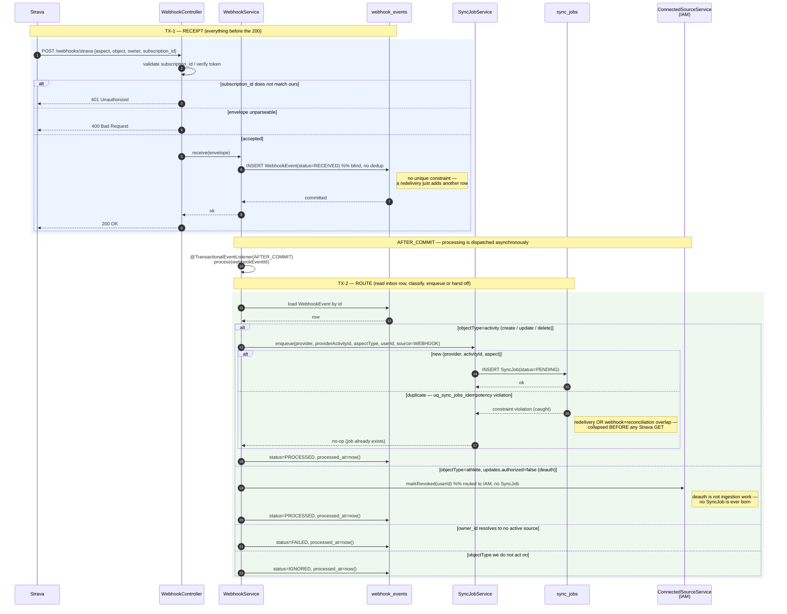

# Sequence: Activity Ingestion — Webhook Channel

How a single Strava webhook delivery travels from the inbound `POST` to a published
`ActivityIngestedEvent` (or a routed deauth, or a no-op duplicate).

This is the **realtime** source of work. The other two sources — initial backfill and
periodic reconciliation — bypass the webhook inbox entirely and converge at `SyncJob`;
see [initial-backfill.md](initial-backfill.md).

Entities, services and locked decisions: [domain-model.md](../../domain-model.md),
[database.md](../../database.md), [events.md](../../events.md), [api.md](../../api.md).

## What this diagram is built to show

1. **Three distinct transactions**, drawn as separate boxed regions — never one long span:
   - **TX-1 (pre-200):** the cheap blind insert of `WebhookEvent(RECEIVED)`, then `200`.
   - **TX-2 (route):** read the event, decide activity-vs-deauth, mark `PROCESSED`,
     and *for activities* enqueue a `SyncJob` (dedup happens here).
   - **TX-3 (hot path):** the worker claims the job, fetches from Strava **outside** any tx,
     then atomically stores the payload, flips the job to `COMPLETED`, and publishes.
2. **The fetch↔publish non-atomicity** — the Strava `GET` sits *before* TX-3 and is not
   transactional with it; only *store* and *publish* are atomic. Called out in a `Note`.
3. **The deauth fork** — not every webhook becomes a `SyncJob`. Shown as an `alt` in TX-2.
4. **The duplicate-delivery path** — a redelivered webhook produces a second `WebhookEvent`
   row (no inbox unique constraint) but is collapsed at the `SyncJob` idempotency constraint.

## Diagram



The hot path (TX-3) is a separate actor on its own clock — the worker sweeps `PENDING`
jobs; it is not in the request thread and not chained synchronously to TX-2. Drawn below.

```mermaid
sequenceDiagram
    autonumber
    participant WK as SyncJobWorker
    participant SJR as sync_jobs
    participant TM as TokenManager<br/>(IAM)
    participant SC as StravaActivityClient
    participant RPS as RawActivityPayloadService
    participant RAP as raw_activity_payloads
    participant EP as event_publication<br/>(Modulith outbox)
    participant DS as downstream<br/>(Catalog, …)

    WK->>SJR: claim runnable job (status=PENDING/FAILED past backoff)
    Note right of SJR: @Version guards the claim race —<br/>only one worker wins PENDING→IN_PROGRESS
    SJR-->>WK: SyncJob (claimed, IN_PROGRESS)

    Note over WK,SC: NETWORK I/O — outside any DB transaction
    rect rgb(255, 248, 235)
        alt aspectType = create / update
            WK->>TM: getValidAccessToken(userId)
            TM-->>WK: access token
            WK->>SC: GET /activities/{providerActivityId}
            alt 200 OK
                SC-->>WK: raw activity JSON
            else 401 token rejected
                SC-->>WK: 401
                WK->>TM: markRevoked(userId)  %% routes to IAM
                Note right of WK: job FAILED → retry/DEAD per policy
            else 429 rate limited
                SC-->>WK: 429 + Retry-After
                Note right of WK: backoff; next_attempt_at advanced;<br/>NEVER fetch inside a webhook request
            else 404
                SC-->>WK: 404
                Note right of WK: activity gone — IGNORE/terminal, harmless
            end
        else aspectType = delete
            Note over WK,SC: no GET — nothing to fetch;<br/>delete-aspect job produces NO RawActivityPayload
        end
    end

    Note over WK,EP: TX-3 — PERSIST & PUBLISH (this, and only this, is atomic)
    rect rgb(245, 240, 255)
        alt create / update
            WK->>RPS: store(payload)
            RPS->>RAP: INSERT raw_activity_payload  %% uq (provider, activityId)
            WK->>EP: publish ActivityIngestedEvent{provider, providerActivityId, rawPayloadId, occurredAt}
            WK->>SJR: status=COMPLETED
        else delete
            WK->>EP: publish ActivityDeletedEvent{provider, providerActivityId, occurredAt}
            WK->>SJR: status=COMPLETED
        end
        Note over RAP,EP: payload row + outbox row commit together —<br/>"stored" and "published" ARE atomic
    end

    Note over WK,EP: ⚠ "fetched" and "published" are NOT atomic.<br/>The GET happened before TX-3. A crash after GET, before store →<br/>job retries; uq_sync_jobs_idempotency makes the re-fetch a no-op.

    EP-->>DS: AFTER_COMMIT delivery (at-least-once; consumers dedup on activity key)
```

## Notes keyed to the locked decisions

- **TX-1 does the absolute minimum.** No `owner_id` resolution, no business logic, no Strava
  call before the `200` — receipt durability is the whole point of the inbox. Strava's
  ~2-second ack budget is never spent on our own DB load.
- **Dedup is on `SyncJob`, not the inbox.** The inbox has *no* unique constraint and accepts
  duplicate rows on purpose; collapsing happens at `uq_sync_jobs_idempotency`
  `(provider, provider_activity_id, aspect_type)` — caught before the expensive `GET`.
  `aspect_type` is in the key because `create`/`update`/`delete` are distinct facts.
- **Deauth bypasses `SyncJob` entirely** — routed to `ConnectedSourceService.markRevoked`
  in IAM, its `WebhookEvent` marked `PROCESSED`. (Invariant 6.)
- **Three convergent sources, one hot path.** Backfill and reconciliation create `SyncJob`s
  directly and ride the *same* TX-3 worker path drawn above — they do not re-enter the inbox.
- **Strava retry as backstop, not substitute.** Strava redelivers up to ~3 times on no-`200`;
  that is a safety net layered on top of our own receipt durability, not a replacement for it.
