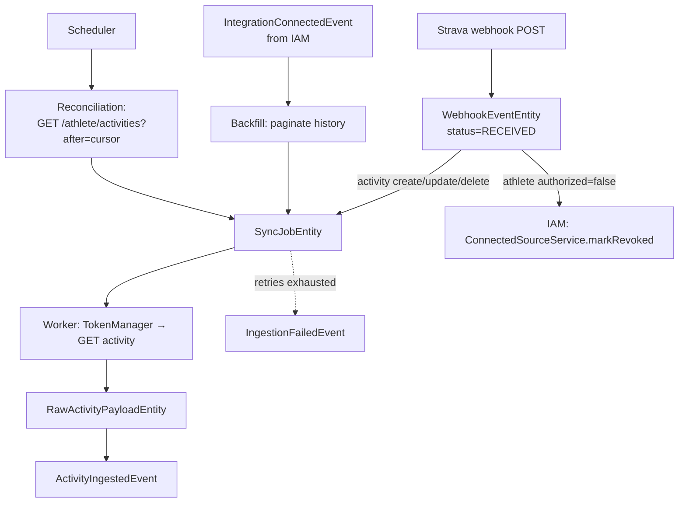

# Activity Ingestion — Domain Model

The domain model for the Activity Ingestion Bounded Context: the data it owns, the services that act on it, the events it emits, and the invariants that hold.

Style: Spring layered (see [ADR 0005](../../adr/0005-bounded-contexts.md)) — entities are plain data, services hold all logic. Naming follows [conventions/naming.md](../../conventions/naming.md).

## Responsibility recap

Ingestion is the **anti-corruption layer** between Strava and the rest of Aperitivo. Everything downstream — Catalog, Analytics, Planning — sees only the clean `ActivityIngestedEvent` and never learns about HTTP retries, webhook signature verification, rate-limit budgets, or Strava's JSON shape. This BC absorbs four kinds of external mess so no one else has to:

1. **Webhook delivery quirks** — at-least-once delivery (duplicates), drops, out-of-order.
2. **Rate limits** — Strava's 100 req / 15 min and 1000 req / day per app. This, not JVM throughput, is the system's real bottleneck.
3. **Strava-specific JSON** — the raw `GET /activities/{id}` body, retained verbatim as `RawActivityPayloadEntity` for replay and forensics.
4. **Auth failures** — a `401` on a data call means the token was rejected; the fact is routed back to IAM (`TokenManager.markRevoked` → `ConnectedSourceService`).

It answers three questions:
1. **What did Strava just tell us?** — `WebhookEventEntity`, the durable inbox of incoming webhook deliveries.
2. **What work do we owe?** — `SyncJobEntity`, the unit of "fetch activity X and run it through the pipeline", with retry semantics and a status machine.
3. **How far have we reliably synced?** — the `SyncCursor` watermark per `(userId, provider)`, used by reconciliation to catch what webhooks missed.

## The receive/process split — why `WebhookEvent` is persisted

Strava `POST`s to our webhook endpoint and expects a `2xx` within **~2 seconds**. Miss that window systematically and Strava treats deliveries as failed — and on chronic failure can deactivate the subscription entirely. So the iron rule on this boundary is: **do the minimum before `200`, defer everything heavy after it.**

We therefore split **receipt** from **processing**:

- **Receipt** is one cheap, blind insert: write the raw webhook body into `webhook_events` with `status = RECEIVED`, respond `200`. No `ConnectedSource` resolution, no business logic, no Strava call — nothing that couples the response to the state of our own database.
- **Processing** happens after commit, asynchronously: a handler reads the `WebhookEventEntity`, routes it (activity → create a `SyncJob`; deauth → call IAM), and marks it `PROCESSED`.

`WebhookEventEntity` is the **durable inbox** that makes this safe. Because we have no message broker ([ADR 0008](../../adr/0008-event-transport.md)), the only durable async queue available is a table. Persisting the webhook *is* the queue: receipt is committed before we answer `200`, so a crash between the response and processing loses nothing — the row is still there to be picked up. (Forensics — a permanent archive of what Strava actually sent — is a real but secondary benefit; the primary motive is durability of receipt.)

> This is the inbox half of the inbox/outbox story. The **outbox** (durable *outbound* events) is provided by Spring Modulith's `event_publication` table for `ActivityIngestedEvent` et al. The **inbox** here is hand-rolled because the inbound source is an external HTTP webhook, not a Modulith event.

## Entities

Entities are plain data: fields, JPA/Hibernate mapping, audit/lifecycle annotations. No behavior.

### WebhookEventEntity

The durable record of one incoming Strava webhook delivery. Written on receipt, before we answer `200`.

```java
@Entity
@Table(name = "webhook_events")
public class WebhookEventEntity {
    @Id
    private UUID id;

    @Column(columnDefinition = "jsonb")
    private String rawBody;              // verbatim webhook JSON (forensics + replay)

    private String aspectType;           // "create" | "update" | "delete"
    private String objectType;           // "activity" | "athlete"
    private long   objectId;             // strava activity id, or athlete id for deauth
    private long   ownerId;              // strava athlete id (owner of the object)

    @Enumerated(EnumType.STRING)
    private WebhookStatus status;        // RECEIVED, PROCESSED, FAILED, IGNORED

    private Instant receivedAt;          // when we accepted the POST
    private Instant processedAt;         // nullable; when processing finished

    @CreationTimestamp
    private Instant createdAt;
}
```

Notes:
- `aspectType` / `objectType` are stored as raw strings, **not** mapped to an enum. They are Strava's vocabulary, not ours; keeping them as strings means an unexpected value from Strava lands in the table as data to inspect rather than blowing up deserialization. (Compare: our *own* `WebhookStatus` is an enum — it's our domain.)
- **No unique constraint.** Duplicate deliveries become duplicate rows on purpose — see the persistence policy below. Insert must never fail on a dup, or we'd jeopardise the cheap `200`.
- `rawBody` is the whole envelope; the parsed-out columns (`aspectType`, `objectId`, …) are conveniences for routing and querying, derived from it.

### SyncJobEntity

A unit of ingestion work: "fetch activity `objectId` for this user and run it through the pipeline." Has retry semantics and a status machine. Born from any of the three sources (webhook, backfill, reconciliation) but the downstream path is identical.

```java
@Entity
@Table(name = "sync_jobs")
public class SyncJobEntity {
    @Id
    private UUID id;

    private UUID userId;                  // id-reference to IAM UserEntity (NOT a JPA association)

    @Enumerated(EnumType.STRING)
    private Provider provider;            // STRAVA in MVP

    private long providerActivityId;     // the Strava activity this job fetches

    private String aspectType;           // "create" | "update" | "delete" — part of the idempotency key

    @Enumerated(EnumType.STRING)
    private SyncJobSource source;         // WEBHOOK | BACKFILL | RECONCILIATION

    @Enumerated(EnumType.STRING)
    private SyncJobStatus status;         // PENDING, IN_PROGRESS, COMPLETED, FAILED, DEAD

    private int attemptCount;
    private Instant nextAttemptAt;        // nullable; backoff schedule for retries
    private String lastError;             // nullable

    @Version
    private long version;                 // optimistic lock — guards concurrent workers claiming a job

    @CreationTimestamp
    private Instant createdAt;
    @UpdateTimestamp
    private Instant updatedAt;
}
```

Notes:
- `userId` is a plain `UUID` id-reference to IAM's `UserEntity`, never a JPA association — Ingestion and IAM are different BCs; there is no `@ManyToOne` across that line.
- The triple `(provider, providerActivityId, aspectType)` is the **idempotency key** and carries a unique constraint — this is the single place dedup is enforced (see persistence policy).
- `@Version` guards the claim race: two workers must not both pick up the same `PENDING` job.

### RawActivityPayloadEntity

The raw JSON returned by Strava's `GET /activities/{id}`, stored verbatim. The archive that lets us re-emit `ActivityIngestedEvent` from stored data — re-running Catalog's normalization without spending rate-limit budget on a second fetch.

```java
@Entity
@Table(name = "raw_activity_payloads")
public class RawActivityPayloadEntity {
    @Id
    private UUID id;

    private UUID userId;                  // id-reference to IAM UserEntity

    @Enumerated(EnumType.STRING)
    private Provider provider;

    private long providerActivityId;     // unique per (provider, providerActivityId)

    @Column(columnDefinition = "jsonb")
    private String payload;              // verbatim Strava activity JSON

    private Instant fetchedAt;           // when we retrieved it from Strava

    @CreationTimestamp
    private Instant createdAt;
}
```

Notes:
- One payload per successfully-fetched activity: unique on `(provider, providerActivityId)`. A failed job produces **no** payload.
- This is an **archive**, not working state. Its retention is long; `SyncJob` rows can be pruned aggressively after success, payloads are kept.
- Lifecycle is distinct from `SyncJob`'s on purpose: the job is *intent and process* ("fetching, attempt 2 of 5"); the payload is *result* ("here's what Strava returned"). One successful job → one payload.

### SyncCursor — a watermark, not an aggregate

The per-`(userId, provider)` high-water mark of synchronization: the timestamp (and tie-break id) of the last activity we've reliably accounted for. Reconciliation reads it to bound its Strava query — `GET /athlete/activities?after={lastSyncedAt}` — so it asks only about the fresh tail instead of re-reading the athlete's entire history every run (which would burn the rate-limit budget that this BC exists to protect).

`SyncCursor` is **not** a rich entity with its own lifecycle or events. It is a pair of columns on a small ingestion-owned sync-state row, one per connected source:

```java
@Entity
@Table(name = "sync_state")
public class SyncStateEntity {
    @Id
    private UUID id;

    private UUID userId;                  // id-reference to IAM UserEntity
    @Enumerated(EnumType.STRING)
    private Provider provider;

    // --- the SyncCursor watermark ---
    private Instant lastSyncedAt;         // reconciliation lower bound (?after=)
    private long    lastSyncedActivityId; // tie-break when timestamps collide

    private Instant lastReconciledAt;     // when reconciliation last ran for this source

    @Version
    private long version;
    @UpdateTimestamp
    private Instant updatedAt;
}
```

> The watermark deliberately does **not** live on IAM's `ConnectedSourceEntity`. Sync progress is an Ingestion concern; IAM knows nothing about activity synchronization. Hanging an ingestion column on an IAM table would be exactly the cross-BC leak that `ApplicationModules.verify()` is there to catch. The cursor lives in Ingestion's own schema.

### Enums and value objects

No suffix (domain types, per the naming convention).

```java
public enum WebhookStatus {
    RECEIVED,   // accepted, not yet processed
    PROCESSED,  // routed successfully (SyncJob created, or deauth handled, or deliberately no-op)
    FAILED,     // could not parse / could not resolve owner_id to a known source
    IGNORED     // valid but not relevant (an object_type we don't act on)
}

public enum SyncJobStatus {
    PENDING,      // created, awaiting a worker
    IN_PROGRESS,  // a worker has claimed it and is fetching
    COMPLETED,    // payload stored, ActivityIngestedEvent emitted
    FAILED,       // last attempt failed; eligible for retry until attempts exhausted
    DEAD          // retries exhausted; IngestionFailedEvent emitted
}

public enum SyncJobSource {
    WEBHOOK,         // realtime, one activity, born from a WebhookEvent
    BACKFILL,        // initial history sync, paginated, triggered by IntegrationConnectedEvent
    RECONCILIATION   // periodic sweep, catches activities missed by dropped webhooks
}
```

## The three sources of work — converging at `SyncJob`



Two things to read off this:

1. **`WebhookEventEntity` is the entry point for the webhook channel only.** Backfill and reconciliation create `SyncJob`s **directly** — they don't fabricate fake webhook rows. The three sources converge at the `SyncJob` level, not before. This keeps `WebhookEvent` honestly meaning "something Strava pushed to us", not "any trigger".

2. **Not every webhook becomes a `SyncJob`.** A deauthorization webhook (`aspectType=update, objectType=athlete, updates.authorized=false`) is not activity work — it's a signal for IAM. Its `WebhookEvent` routes straight to `ConnectedSourceService.markRevoked` and is marked `PROCESSED` with no `SyncJob` born. `WebhookEvent` is the common inbox; `SyncJob` is specific to activity ingestion.

## Persistence policy — Hibernate use in Ingestion

Like IAM, Ingestion uses **no JPA associations** — every cross-entity link is a plain id field, navigated via repositories. All `userId` references point at IAM's `UserEntity` across a BC boundary, so they could never be associations anyway. Within the BC, the entities are also kept association-free: a `SyncJob`, its eventual `RawActivityPayload`, and the originating `WebhookEvent` are correlated by `(provider, providerActivityId)` and queried explicitly, not wired with `@OneToOne`/`@ManyToOne`. The full association toolkit is reserved for Catalog and Planning, where aggregates have genuine internal structure.

The Hibernate features Ingestion *does* use:
- `@Version` optimistic locking on `SyncJobEntity` (the worker-claim race) and `SyncStateEntity` (concurrent cursor updates).
- `@Enumerated(EnumType.STRING)` for our own enums (`WebhookStatus`, `SyncJobStatus`, `SyncJobSource`, `Provider`).
- `jsonb` columns for `rawBody` and `payload`.
- Auditing via `@CreationTimestamp` / `@UpdateTimestamp`.

### Idempotency: one key, one place

There are **two** real sources of duplicate work, and one mechanism handles both:

- **At-least-once webhook redelivery** — Strava retries a delivery up to 3 attempts if it doesn't get a `200`, so the same webhook can arrive more than once, seconds apart.
- **Webhook + reconciliation overlap** — the webhook ingested an activity at T=0; hours later reconciliation queries `?after=cursor`, the same activity falls in the window, and Strava returns it again.

Dedup lives **only on `SyncJob`**, via the unique constraint on `(provider, providerActivityId, aspectType)`. When any source tries to create a job for an activity+aspect already in flight or done, the constraint makes it a no-op. This catches the dup **before** the expensive `GET /activities/{id}`, saving rate-limit budget — earlier than Catalog's own downstream dedup on `providerActivityId`.

`aspectType` is in the key, not just `providerActivityId`, because Strava sends genuinely different facts about one activity: `create`, then `update` (the athlete renamed it), then `delete`. Those are three distinct jobs, not redeliveries of one — collapsing them to "already saw 12345" would drop the update and the delete.

**`WebhookEvent` carries no dedup constraint by design.** It records *deliveries* as they arrive, dups included — that's the honest forensic log of what Strava sent, and it keeps the receipt insert unconditionally cheap. Dedup is the *job's* concern, not the inbox's. Two identical webhooks → two `webhook_events` rows → one `sync_jobs` row.

## Repositories

Spring Data JPA, no logic.

```java
public interface WebhookEventRepository extends JpaRepository<WebhookEventEntity, UUID> {
    List<WebhookEventEntity> findByStatus(WebhookStatus status);
}

public interface SyncJobRepository extends JpaRepository<SyncJobEntity, UUID> {
    Optional<SyncJobEntity> findByProviderAndProviderActivityIdAndAspectType(
            Provider provider, long providerActivityId, String aspectType);
    List<SyncJobEntity> findByStatusAndNextAttemptAtBefore(SyncJobStatus status, Instant cutoff);
}

public interface RawActivityPayloadRepository extends JpaRepository<RawActivityPayloadEntity, UUID> {
    Optional<RawActivityPayloadEntity> findByProviderAndProviderActivityId(
            Provider provider, long providerActivityId);
}

public interface SyncStateRepository extends JpaRepository<SyncStateEntity, UUID> {
    Optional<SyncStateEntity> findByUserIdAndProvider(UUID userId, Provider provider);
    List<SyncStateEntity> findAll();   // reconciliation sweep iterates active sources
}
```

## Services — where all logic lives

### WebhookService — receipt and routing

Two responsibilities, deliberately split across the 2-second boundary.

```java
@Service
public class WebhookService {

    // Called synchronously by WebhookController, BEFORE responding 200.
    // Does the absolute minimum: verify, persist raw, return.
    @Transactional
    public UUID receive(String rawBody, WebhookHeaders headers) {
        // 1. verify signature / subscription token (cheap, in-memory)
        // 2. parse just enough to fill the routing columns
        // 3. INSERT WebhookEventEntity (status=RECEIVED)
        // 4. return its id → controller responds 200
    }

    // Called asynchronously AFTER commit (e.g. @Async on a RECEIVED event,
    // or a poller over findByStatus(RECEIVED)).
    @Transactional
    public void process(UUID webhookEventId) {
        // route by (objectType, aspectType):
        //   activity create/update/delete → SyncJobService.enqueue(...) ; status=PROCESSED
        //   athlete   authorized=false    → ConnectedSourceService.markRevoked(...) ; status=PROCESSED
        //   irrelevant object_type        → status=IGNORED
        //   unresolvable owner_id         → status=FAILED
    }
}
```

`receive` touches nothing but its own table; `process` is where `ConnectedSource` resolution and job creation happen — off the Strava-facing hot path.

### SyncJobService — work creation and idempotency

The single funnel through which all three sources create jobs. Owns the dedup decision.

```java
@Service
public class SyncJobService {

    // Idempotent: dedups on (provider, providerActivityId, aspectType).
    // Returns existing job if already present; creates PENDING otherwise.
    @Transactional
    public SyncJobEntity enqueue(UUID userId, Provider provider, long providerActivityId,
                                 String aspectType, SyncJobSource source);

    // Worker claim + lifecycle transitions (PENDING→IN_PROGRESS→COMPLETED/FAILED, retry, DEAD).
    @Transactional
    public Optional<SyncJobEntity> claimNext();
    @Transactional
    public void markCompleted(UUID jobId);
    @Transactional
    public void markFailed(UUID jobId, String error);   // schedules retry or transitions to DEAD
}
```

### SyncJobWorker — the hot path against Strava

The component that actually calls Strava. Always asynchronous — never inside a webhook request.

```java
@Service
public class SyncJobWorker {
    // For a claimed job: resolve token, fetch, store payload, emit event.
    void run(SyncJobEntity job) {
        // 1. token = tokenManager.getValidAccessToken(job.userId)   // IAM, in-process
        // 2. raw  = stravaActivityClient.getActivity(job.providerActivityId, token)
        // 3. rawActivityPayloadService.store(...)                   // RawActivityPayloadEntity
        // 4. publish ActivityIngestedEvent (normalized pre-Workout shape)
        // 5. syncJobService.markCompleted(job.id)
        // on 401 → tokenManager.markRevoked(...) ; markFailed/DEAD as appropriate
        // on 429 → respect rate-limit budget, reschedule (markFailed with backoff)
    }
}
```

> Rate-limit governance (budget tracking, 429 backoff, fair-share across users) and the per-user token-refresh lock are mechanics detailed in their own technical notes ([strava-rate-limits.md](../../technical-notes/strava-rate-limits.md) — *to be written*, [token-management.md](../../technical-notes/token-management.md)); this BC doc fixes the contract, not the mechanism.

### BackfillService and ReconciliationService — the other two sources

```java
@Service
public class BackfillService {
    // Triggered by IntegrationConnectedEvent. Paginates the athlete's history,
    // enqueuing a SyncJob per activity (source=BACKFILL). Rate-limit-aware.
    @ApplicationModuleListener
    void onIntegrationConnected(IntegrationConnectedEvent event);
}

@Service
public class ReconciliationService {
    // Scheduled sweep. For each ACTIVE source: GET /athlete/activities?after={cursor},
    // enqueue a SyncJob per not-yet-seen activity (source=RECONCILIATION),
    // then advance the cursor.
    @Scheduled(/* every N hours */)
    void reconcileAll();
}
```

Reconciliation is **the correctness guarantee**; webhooks are a latency optimization on top of it. If webhooks were switched off entirely, the system would stay consistent — just with reconciliation-window latency instead of seconds. A healthy sign: the hot path is the optimization, the cold path is the guarantee.

### Supporting collaborators

- `StravaActivityClient` — thin HTTP wrapper over `GET /activities/{id}` and `GET /athlete/activities`. Lives in Ingestion.
- `TokenManager` (IAM, in-process) — the **only** way Ingestion obtains a Strava access token. Called by `SyncJobWorker`; never bypassed.

## Events published

All via `ApplicationEventPublisher`, consumed after commit. Records, not Spring `ApplicationEvent` subclasses.

| Event | Emitted by | When |
|---|---|---|
| `ActivityIngestedEvent` | `SyncJobWorker` | an activity payload is fetched, stored, and normalized (per successful job) |
| `ActivityDeletedEvent` | `SyncJobWorker` | a `delete`-aspect job is processed |
| `IngestionFailedEvent` | `SyncJobService` | a job exhausts retries and transitions to `DEAD` |

Payload schemas: see [events.md](events.md).

## Events consumed

| Event | From | Handler action |
|---|---|---|
| `IntegrationConnectedEvent` | IAM | `BackfillService` starts the initial history backfill for the new source |
| `IntegrationRevokedEvent` | IAM | cancel pending `SyncJob`s for the user; stop issuing Strava calls |

Both consumers are idempotent: backfill keys jobs on the same `(provider, providerActivityId, aspectType)` dedup, and revocation handling is a naturally idempotent state transition (cancelling already-cancelled jobs is a no-op).

## Invariants

Enforced by services and the schema, not by entity behavior.

1. **Receipt is durable before `200`.** A `WebhookEventEntity` row is committed before the webhook endpoint responds. A crash after the response loses no webhook.
2. **An activity is ingested exactly once into the canonical model**, regardless of how many webhook deliveries or reconciliation hits reference it. Enforced by the unique constraint on `SyncJob (provider, providerActivityId, aspectType)`.
3. **No data loss.** Every dropped webhook is caught by reconciliation within the next sync window (`?after={cursor}`).
4. **Rate-limit compliance.** The BC never exceeds Strava's 100/15min or 1000/day budget; the worker respects `429` with backoff and never fetches inside a webhook request.
5. **A failed job produces no payload.** `RawActivityPayloadEntity` exists only for successfully fetched activities; one payload per `(provider, providerActivityId)`.
6. **Deauth never creates a `SyncJob`.** A deauthorization webhook routes to IAM and marks its `WebhookEvent` `PROCESSED`; no ingestion work is enqueued.
7. **The cursor only advances over reliably-accounted activities**, so reconciliation never skips a gap. Cursor updates are serialized per source via `@Version`.

## Collaboration summary

```
WebhookController → WebhookService.receive (sync, pre-200)
WebhookService.process → SyncJobService.enqueue | ConnectedSourceService.markRevoked (IAM)
BackfillService (on IntegrationConnectedEvent) → SyncJobService.enqueue
ReconciliationService (scheduled) → StravaActivityClient, SyncJobService.enqueue, SyncStateRepository
SyncJobWorker → TokenManager.getValidAccessToken (IAM), StravaActivityClient,
                RawActivityPayloadService, (publishes ActivityIngested / ActivityDeleted)
SyncJobService → SyncJobRepository, (publishes IngestionFailed)
```

`WebhookEvent` (inbox, receipt durability) and `SyncJob` (work, retry) are kept as separate entities on purpose: the inbox answers "what did Strava send, and have we routed it?", the job answers "what work do we owe, and how is it going?". They correlate by `(provider, providerActivityId)` but have independent lifecycles — and only the webhook channel passes through the inbox at all.

## Next documents in this BC

- [database.md](database.md) — DDL, indexes, migrations
- [events.md](events.md) — event payload schemas (`ActivityIngested`, `ActivityDeleted`, `IngestionFailed`)
- [api.md](api.md) — webhook receiver endpoint, internal sync triggers
- Sequence diagrams: `diagrams/sequence/activity-ingestion-webhook.md`, `initial-backfill.md`
