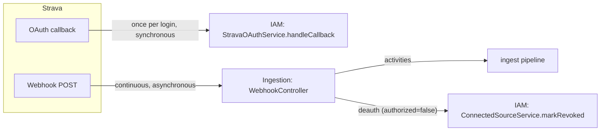

# Identity & Access — Domain Model

The domain model for the Identity & Access (IAM) Bounded Context: the data it owns, the services that act on it, the events it emits, and the invariants that hold.

Style: Spring layered (see [ADR 0005](../../adr/0005-bounded-contexts.md)) — entities are plain data, services hold all logic. Naming follows [conventions/naming.md](../../conventions/naming.md).

## Responsibility recap

IAM answers three questions:
1. **Who is this user?** — the internal `UserEntity` (a stable UUID identity).
2. **What external sources have they connected, and are those connections healthy?** — `ConnectedSourceEntity` and its lifecycle.
3. **How do we authenticate them and let the rest of the system authorize them?** — Strava OAuth login plus our own JWT issuance.

## Entities

Entities are plain data: fields, JPA/Hibernate mapping, audit/lifecycle annotations. No behavior.

### UserEntity

The internal identity record. Holds nothing provider-specific.

```java
@Entity
@Table(name = "users")
public class UserEntity {
    @Id
    private UUID id;                 // internal identity, our UUID

    private String displayName;      // from Strava profile at provisioning
    private String email;            // nullable; from Strava, may be absent
    private String avatarUrl;        // nullable; Strava profile picture

    @CreationTimestamp
    private Instant createdAt;
    @UpdateTimestamp
    private Instant updatedAt;
}
```

`UserEntity` has **no** `status`, **no** tokens, **no** `strava_*` fields. It exists for as long as the person exists in the system. Provider concerns live entirely on `ConnectedSourceEntity`.

### ConnectedSourceEntity

A credentialed link from a user to an external provider, with its own lifecycle.

```java
@Entity
@Table(name = "connected_sources")
public class ConnectedSourceEntity {
    @Id
    private UUID id;

    private UUID userId;                  // id-reference to UserEntity (NOT a JPA association)

    @Enumerated(EnumType.STRING)
    private Provider provider;            // STRAVA (future: GARMIN, …)

    private String providerUserId;        // e.g. strava_athlete_id, as string

    @Convert(converter = EncryptedBytesConverter.class)
    private String accessToken;           // stored AES-GCM encrypted (bytea on disk)
    @Convert(converter = EncryptedBytesConverter.class)
    private String refreshToken;          // stored AES-GCM encrypted (bytea on disk)
    private Instant accessTokenExpiresAt;

    @Type(StringArrayType.class)
    private String[] scopes;              // granted OAuth scopes (Postgres text[])

    @Enumerated(EnumType.STRING)
    private SourceStatus status;          // ACTIVE, REVOKED, ERROR

    private int failureCount;
    private String lastError;             // nullable

    private Instant lastRefreshedAt;      // nullable
    private Instant lastUsedAt;           // nullable

    @Version
    private long version;                 // optimistic lock — guards concurrent refresh

    @CreationTimestamp
    private Instant createdAt;
    @UpdateTimestamp
    private Instant updatedAt;
}
```

### Enums and value objects

No suffix (they are domain types, per the naming convention).

```java
public enum Provider {
    STRAVA
    // future: GARMIN, WAHOO, COROS, SUUNTO, POLAR, TRAININGPEAKS
}

public enum SourceStatus {
    ACTIVE,    // tokens valid, sync allowed
    REVOKED,   // user/Strava revoked access; no sync; needs reconnect
    ERROR      // transient failure; retry policy applies
}

// immutable data holders (records)
public record StravaTokens(String accessToken, String refreshToken,
                           Instant expiresAt, String[] scopes) {}

public record StravaProfile(String athleteId, String displayName,
                            String email, String avatarUrl) {}

public record StravaOAuthResult(StravaProfile profile, StravaTokens tokens) {}

public record StravaToken(String accessToken) {}   // what TokenManager hands to Ingestion
```

## Persistence policy — Hibernate use in IAM

IAM deliberately uses **no JPA associations**. `ConnectedSourceEntity.userId` is a plain `UUID`, not a `@ManyToOne UserEntity`. Navigation is via repository methods.

Rationale:
- `UserEntity` and `ConnectedSourceEntity` are **separate aggregates** with independent lifecycles ([ADR 0004](../../adr/0004-user-model-and-connected-sources.md)). DDD guidance: reference across aggregate boundaries by id, not by object association.
- Avoids any chance of tokens being pulled in transitively when reading a user (a `@OneToMany` would make that a footgun in a logger or serializer).
- Makes N+1 structurally impossible here: there is no lazy collection to trigger it. Reads are always explicit (`connectedSourceRepository.findByUserIdAndProvider(...)`).

This does **not** mean "no Hibernate." IAM uses the Hibernate features that *fit* an association-free design:
- `@Convert` with a custom `AttributeConverter` (`EncryptedBytesConverter`) for AES-GCM column encryption.
- A custom type for the Postgres `text[]` `scopes` column.
- `@Version` optimistic locking on `ConnectedSourceEntity` — directly relevant to concurrent token refresh (see [token-management.md](../../technical-notes/token-management.md)).
- Auditing via `@CreationTimestamp` / `@UpdateTimestamp`.

The full association toolkit (`@OneToMany`, fetch strategies, `@BatchSize`, entity graphs, cascades, orphan removal, second-level cache) is exercised in **Workout Catalog** and **Training Planning**, *within* their aggregates, where it is architecturally correct. Each such choice is documented with its rationale in those BCs.

## Repositories

Spring Data JPA, no logic.

```java
public interface UserRepository extends JpaRepository<UserEntity, UUID> {
}

public interface ConnectedSourceRepository extends JpaRepository<ConnectedSourceEntity, UUID> {
    Optional<ConnectedSourceEntity> findByProviderAndProviderUserId(Provider provider, String providerUserId);
    Optional<ConnectedSourceEntity> findByUserIdAndProvider(UUID userId, Provider provider);
    List<ConnectedSourceEntity> findByStatus(SourceStatus status);
}
```

## Services — where all logic lives

Four services, by responsibility.

### StravaOAuthService — login orchestration

The IAM entry point for the **OAuth callback channel only** (see "Two Strava channels" below). Runs once per login.

```java
@Service
public class StravaOAuthService {

    @Transactional
    public UserEntity handleCallback(StravaOAuthResult oauth) {
        // 1. resolve or create UserEntity by (STRAVA, athleteId)
        // 2. create or update the STRAVA ConnectedSourceEntity with encrypted tokens
        // 3. publish UserRegisteredEvent (if newly created) + IntegrationConnectedEvent
        // 4. return UserEntity → the controller issues the JWT
    }
}
```

`handleCallback` does **only** login completion. It does not handle activities or deauthorization — those arrive on the webhook channel, in Activity Ingestion.

### UserService — identity CRUD

```java
@Service
public class UserService {
    UserEntity findById(UUID userId);
    Optional<UserEntity> findByProviderIdentity(Provider provider, String providerUserId);
    UserEntity createFromStravaProfile(StravaProfile profile);
    void updateProfile(UUID userId, ProfileUpdateDto update);
}
```

Knows nothing about tokens.

### ConnectedSourceService — connection lifecycle

Owns the `ACTIVE → REVOKED / ERROR` transitions and emits `IntegrationRevokedEvent`.

```java
@Service
public class ConnectedSourceService {
    ConnectedSourceEntity createStravaSource(UUID userId, String athleteId,
                                             StravaTokens tokens);
    void markRevoked(UUID userId, Provider provider, RevocationReason reason);
    void markError(UUID userId, Provider provider, String error);
    void recordSuccessfulUse(UUID userId, Provider provider);
    Optional<ConnectedSourceEntity> findActive(UUID userId, Provider provider);
}
```

### TokenManager — sole token gatekeeper

The only code in the entire system that reads, decrypts, or refreshes tokens. Activity Ingestion calls **only** this. Keeps the `Manager` suffix to signal that role (see naming conventions).

```java
@Service
public class TokenManager {
    StravaToken getValidAccessToken(UUID userId);     // hot path; lazy refresh under per-user lock
    void markRevoked(UUID userId, RevocationReason reason);
    void recordFailure(UUID userId, FailureKind kind);
    void recordSuccessfulUse(UUID userId);
}
```

Refresh mechanics (per-user lock, lazy vs proactive, 401 handling) are detailed in [token-management.md](../../technical-notes/token-management.md). This BC doc fixes only the contract.

### Supporting collaborator

`StravaOAuthClient` — a thin HTTP wrapper over Strava's OAuth token endpoint (`POST /oauth/token`), used by both login (code exchange) and `TokenManager` (refresh). Lives in IAM.

## Two Strava channels — critical distinction

Strava reaches us through **two independent channels**, owned by **different BCs**. Confusing them is a design error.



- **OAuth callback channel** → IAM. A one-time, user-initiated login completion. Handled by `StravaOAuthService.handleCallback`.
- **Webhook channel** → Activity Ingestion's `WebhookController`. Continuous, Strava-initiated. Carries activity create/update/delete **and** deauthorization (`aspect_type=update, updates.authorized=false`). Deauth is routed back to IAM's `ConnectedSourceService.markRevoked`, but it arrives via the webhook channel, not the OAuth callback.

So: **login enters through IAM; everything ongoing (activities, deauth) enters through Ingestion.** Two endpoints, two lifecycles, two BCs.

## Identity tokens — the `sub` claim

The JWT we issue carries our **internal `user_id` (UUID)** as `sub`. Never `providerUserId`.

```
JWT claims:
  sub = user_id (UUID)          ← our stable internal identity
  iss = https://aperitivo.<…>   ← issuer (us)
  iat, exp (24–72h), jti
```

Why `sub` must be `user_id`, not `providerUserId`:
- `sub` identifies the user **in our system**; our identity handle is `user_id`, which is stable for the life of the account.
- `providerUserId` is an attribute of a *connected source*. It is provider-specific and would differ (or change) if the user switched or added providers. A user with both Strava and Garmin would have two `providerUserId`s — there is no single value to put in `sub`.
- Putting `providerUserId` in `sub` would break identity the moment a user's provider set changes. This is exactly the kind of choice that is painful to reverse later.

`providerUserId` never enters the JWT. It is needed only by Activity Ingestion when talking to Strava, and is read from `ConnectedSourceEntity`, not from the token.

JWT issuance/validation mechanics (RS256 keys, JWKS, `jti` blacklist) are covered in the JWT technical note.

## Events published

All via `ApplicationEventPublisher`, consumed after commit (`@TransactionalEventListener(AFTER_COMMIT)` / `@ApplicationModuleListener` on the consumer side). Events are records, not Spring `ApplicationEvent` subclasses.

| Event | Emitted by | When |
|---|---|---|
| `UserRegisteredEvent` | `StravaOAuthService` | a new `UserEntity` is created (first login) |
| `IntegrationConnectedEvent` | `StravaOAuthService` | a new `ConnectedSourceEntity` becomes `ACTIVE` |
| `IntegrationRevokedEvent` | `ConnectedSourceService` | a source transitions to `REVOKED` |

Payload schemas: see [events.md](events.md) (next document).

## Events consumed

None from inside the system. External inputs are the Strava OAuth callback (handled here) and the Strava deauthorization webhook (handled in Ingestion, routed back to `ConnectedSourceService`).

## Invariants

Enforced by services and the schema, not by entity behavior.

1. **`UserEntity` holds no provider-specific fields.** Enforced by code review and an architecture test asserting the field set.
2. **`(provider, provider_user_id)` is unique.** DB unique constraint; `findByProviderIdentity` checks before creating.
3. **At most one non-revoked `ConnectedSourceEntity` per `(userId, provider)`.** Enforced by a partial unique index on `(user_id, provider)` where `status <> 'REVOKED'`, which still allows a fresh source after a revoke (reconnect).
4. **Tokens never leave `TokenManager` in plaintext** except at the moment of a Strava API call. No other component decrypts them.
5. **Every transition to `REVOKED` emits `IntegrationRevokedEvent`.** Otherwise Ingestion would keep running sync jobs against a dead connection.
6. **Concurrent refresh is serialized per user.** Guarded by `@Version` optimistic locking plus the per-user lock described in the token-management note.

## Collaboration summary

```
StravaOAuthService → UserService, ConnectedSourceService, StravaOAuthClient
ConnectedSourceService → ConnectedSourceRepository, (publishes events)
UserService → UserRepository
TokenManager → ConnectedSourceRepository, StravaOAuthClient
Activity Ingestion (other BC) → TokenManager.getValidAccessToken() ONLY
```

`TokenManager` and `ConnectedSourceService` are kept separate on purpose: `TokenManager` is a narrow, stable contract exposed to another BC (Ingestion) for hot-path token access; `ConnectedSourceService` is IAM-internal lifecycle management. Different audiences, different cadence of change.

## Next documents in this BC

- [database.md](database.md) — DDL, indexes, migrations
- [events.md](events.md) — event payload schemas
- [api.md](api.md) — REST endpoints (login initiation, callback, current user)
- Sequence diagram: `diagrams/sequence/strava-oauth-login.md`
- [token-management.md](../../technical-notes/token-management.md) — already written
