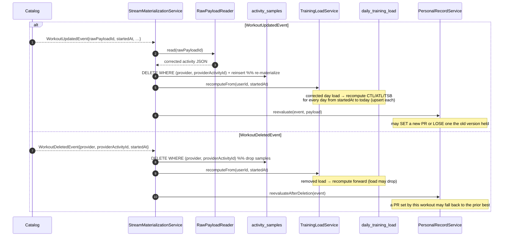

# Sequence: Performance Analytics — Stream Materialization & Recompute

How tier-3 telemetry and derived metrics are built from a workout: consuming Catalog's
`WorkoutCreated`/`WorkoutUpdated`/`WorkoutDeleted`, reading the archived payload, bulk-loading the
TimescaleDB hypertable, and rolling CTL/ATL/TSB and PRs forward. This is the downstream end of the
[Catalog normalization flow](../../../workout-catalog/diagrams/sequence/activity-normalization.md).

Contracts: [domain-model.md](../../domain-model.md), [events.md](../../events.md),
[database.md](../../database.md), [timescaledb-schema.md](../../../../technical-notes/timescaledb-schema.md).

## What this diagram shows

1. **Three distinct reactions** to three distinct events — create folds load in, update
   re-materializes + recomputes forward, delete drops samples + recomputes forward. (This is why
   Catalog splits the events.)
2. **Streams read from the archive**, by `rawPayloadId`, via Ingestion's published port — no Strava
   call, idempotent, replayable.
3. **Bulk hypertable load**, delete-by-activity + insert, never an ORM collection.
4. **The recompute chain** — a changed/removed day invalidates CTL/ATL/TSB from that day forward.
5. **PR emission** — the one outward event, to Notifications.

## Create — the common path

```mermaid
sequenceDiagram
    autonumber
    participant CAT as Catalog<br/>(event_publication)
    participant SM as StreamMaterializationService
    participant RPR as RawPayloadReader<br/>(Ingestion published port)
    participant HT as activity_samples<br/>(TimescaleDB hypertable)
    participant TL as TrainingLoadService
    participant DTL as daily_training_load
    participant PR as PersonalRecordService
    participant EP as event_publication<br/>(Analytics outbox)
    participant NOT as Notifications

    CAT-->>SM: @ApplicationModuleListener WorkoutCreatedEvent<br/>{userId, provider, providerActivityId, rawPayloadId, startedAt, …}
    Note over SM: AFTER_COMMIT of Catalog's write — at-least-once, idempotent

    SM->>RPR: read(rawPayloadId)
    RPR-->>SM: raw activity JSON (numeric streams: hr/watts/cadence/velocity/altitude)

    Note over SM,HT: bulk load — delete-by-activity then COPY/insert (idempotent)
    rect rgb(255, 248, 235)
        SM->>HT: DELETE WHERE (provider, providerActivityId)
        SM->>HT: bulk INSERT samples (thousands of rows)
    end

    SM->>TL: applyNewWorkout(event)
    Note over TL: compute per-workout load (power→TSS / HR→TRIMP / duration fallback)
    TL->>DTL: upsert (user_id, day) load; roll CTL/ATL/TSB forward to today

    SM->>PR: evaluate(event, payload)
    Note over PR: compute power/pace curve from streams; compare to current bests
    alt new best achieved
        PR->>EP: publish PersonalRecordSetEvent{recordType, value, previousValue, …}
        EP-->>NOT: AFTER_COMMIT → "New 5k PR!" notification
    else no new record
        Note over PR: curve/PR rows updated; no event
    end
```

## Update & delete — the recompute branch



## Notes keyed to the locked decisions

- **Right storage per shape.** Samples go to the hypertable by **bulk insert**, never an
  `@OneToMany`; derived load/PRs are **upserts** on small relational tables. The two shapes, one
  BC — the deliberate counterweight to Catalog's association-heavy aggregate
  ([domain-model.md](../../domain-model.md)).
- **Idempotency by construction.** Materialization is delete-by-activity + insert; load recompute
  upserts `(user_id, day)`; PR evaluation is idempotent. A redelivered event re-runs safely.
- **The recompute chain is the reason for split events.** Only update/delete recompute forward;
  create folds in. A single merged "workout changed" event would force Analytics to diff to decide
  its blast radius — the split moves that knowledge to the event type ([events.md](../../events.md)).
- **Archive is the source of truth.** Streams come from `RawActivityPayload` via the published
  port; Strava is never called. A materialization bug is fixed and replayed over the archive — the
  same property that lets old hypertable chunks be retention-dropped without data loss
  ([timescaledb-schema.md](../../../../technical-notes/timescaledb-schema.md)).
- **One outward event.** Only `PersonalRecordSetEvent` leaves the BC (→ Notifications). Fitness,
  curves, and traces are read via the API, not broadcast — continuous state is queried, discrete
  facts are events.
