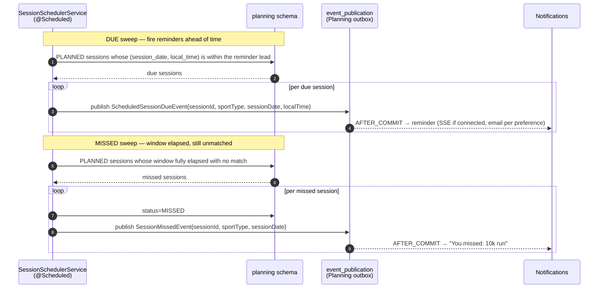

# Sequence: Training Planning — Planned-vs-Actual Matching

How a `WorkoutCreated` is reconciled against the plan: candidate selection, scoring (with the
two-workouts-one-day ambiguity), compliance computation, and the `SessionCompleted` emit — plus the
scheduler's `ScheduledSessionDue` and `SessionMissed` paths. This is the consuming end of
[Catalog's normalization flow](../../../workout-catalog/diagrams/sequence/activity-normalization.md).

Contracts: [domain-model.md](../../domain-model.md), [events.md](../../events.md),
[database.md](../../database.md).

## What this diagram shows

1. **Candidate selection** — only `PLANNED` sessions in a ±1-day window of matching sport.
2. **Scoring resolves ambiguity** — best (session, workout) pair by score; each matches at most one.
3. **Manual override is respected** — manually-linked sessions are skipped by auto-matching.
4. **Compliance without Analytics** — deltas from directly-readable workout dimensions; **no actual
   TSS read** (the decoupling).
5. **The scheduler's two timers** — `ScheduledSessionDue` ahead of time, `SessionMissed` after the
   window elapses unmatched.

## Matching on `WorkoutCreated`

```mermaid
sequenceDiagram
    autonumber
    participant CAT as Catalog<br/>(event_publication)
    participant SM as SessionMatchingService
    participant DB as planning schema
    participant EP as event_publication<br/>(Planning outbox)
    participant NOT as Notifications

    CAT-->>SM: @ApplicationModuleListener WorkoutCreatedEvent<br/>{workoutId, userId, sportType, startedAt, distanceM, movingTimeSec}
    Note over SM: AFTER_COMMIT of Catalog's write — at-least-once, idempotent

    Note over SM,DB: CANDIDATE SELECTION
    SM->>DB: PLANNED sessions WHERE user, sport compatible,<br/>session_date within ±1 day of workout local date<br/>(ix_sessions_match_candidates)
    DB-->>SM: candidate sessions (0..n)

    alt no candidates
        Note over SM: workout fulfils no planned session — nothing to do
    else candidates exist
        Note over SM: SCORING — resolve ambiguity (e.g. 2 runs same day)
        SM->>SM: score each (session, workout) pair:<br/>date proximity + sport exactness + target similarity
        SM->>SM: pick best pair; skip sessions already manual-matched;<br/>each session ↔ at most one workout (greedy by score)

        alt a winning match
            Note over SM,DB: COMPLIANCE — directly-readable dimensions only (NO actual TSS)
            SM->>SM: per-target delta (planned vs workout distance/duration/pace)
            SM->>DB: set matched_workout_id, match_is_manual=false,<br/>compliance_score; status=COMPLETED
            SM->>DB: INSERT compliance_deltas (per target; no TSS row in MVP)
            SM->>EP: publish SessionCompletedEvent{sessionId, matchedWorkoutId, complianceScore, manualMatch=false}
            EP-->>NOT: AFTER_COMMIT → "Session complete — 92% to plan"
        else best score below threshold
            Note over SM: no confident match — leave session PLANNED<br/>(scheduler may later mark MISSED)
        end
    end
```

## Update / delete re-evaluation

```mermaid
sequenceDiagram
    autonumber
    participant CAT as Catalog
    participant SM as SessionMatchingService
    participant DB as planning schema
    participant EP as event_publication<br/>(Planning outbox)

    alt WorkoutUpdatedEvent
        CAT-->>SM: WorkoutUpdatedEvent{workoutId, …changed dimensions…}
        SM->>DB: find session matched to this workout (ix_sessions_matched_workout)
        alt was matched & match is manual
            Note over SM: manual override is sticky — re-score compliance only,<br/>do NOT re-assign
            SM->>DB: update compliance_score + deltas
        else was matched, automatic
            SM->>SM: re-run candidate select + score (dimensions changed)
            SM->>DB: keep / move match; update compliance
            SM->>EP: publish SessionCompleted (if match changed)
        else not previously matched
            Note over SM: treat as a fresh match attempt (like create)
        end
    else WorkoutDeletedEvent
        CAT-->>SM: WorkoutDeletedEvent{workoutId}
        SM->>DB: find session matched to this workout
        alt found
            SM->>DB: clear matched_workout_id; status back to PLANNED;<br/>delete compliance_deltas
            Note over SM: session may later go MISSED if its window has passed
        else none
            Note over SM: no-op
        end
    end
```

## The scheduler — due and missed



## Notes keyed to the locked decisions

- **TSS decoupling holds in the hot path.** Compliance is computed from distance/duration/pace —
  dimensions on the `WorkoutCreated` payload or readable from Catalog — and explicitly **does not**
  read Analytics' actual TSS. The planned `TSS` target is shown but not evaluated in MVP
  ([domain-model.md](../../domain-model.md)). No Analytics dependency in matching.
- **Ambiguity is deterministic.** Two workouts on one day, or two candidate sessions, resolve by
  descending match score with one-to-one assignment — never a random or double match (invariant 1).
- **Manual override is sticky across re-evaluation.** A `WorkoutUpdated` re-scores a manual match's
  compliance but never re-assigns it (invariant 2).
- **create/update/delete each react differently** — match, re-evaluate, un-match — which is why
  Catalog splits them ([events.md](../../events.md)); a merged event would force a diff.
- **Atomic match + publish.** The match/compliance write and `SessionCompleted` share one
  transaction (Outbox); a crash re-runs on the redelivered `WorkoutCreated`, idempotent by
  `matched_workout_id`.
- **Two scheduler timers, both feed Notifications.** `ScheduledSessionDue` (reminder) and
  `SessionMissed` (accountability) are the planning loop's user-facing pulse.
```
