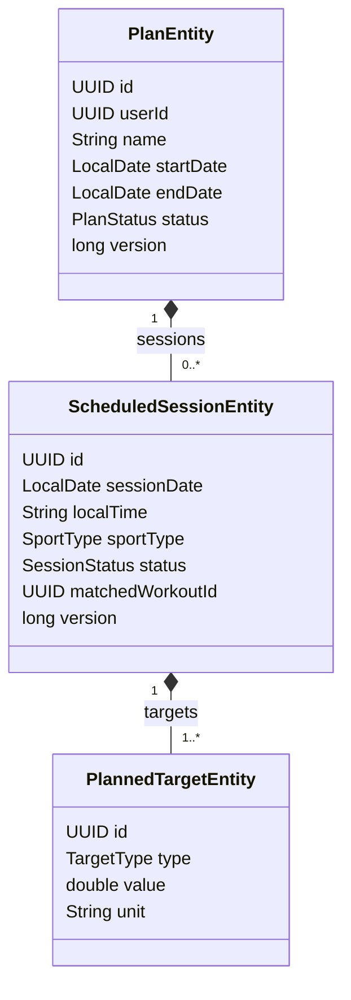

# Training Planning — Domain Model

The domain model for the Training Planning Bounded Context: the `Plan` aggregate, scheduled
sessions and their targets, the planned-vs-actual matching engine, and the events it emits. This
is the only **forward-looking** BC — Catalog and Analytics describe the past; Planning describes
the intended future and reconciles it with the past as workouts arrive.

Style: Spring layered ([ADR 0005](../../adr/0005-bounded-contexts.md)) — entities are data,
services hold logic. Naming: [conventions/naming.md](../../conventions/naming.md). Like Catalog,
this BC legitimately uses the **Hibernate association toolkit within its aggregate** — a `Plan` is
a genuine composition of scheduled sessions and their targets.

## Responsibility recap

Planning owns the athlete's **intended** training and the reconciliation of intent against reality:

1. **Hold plans** — a `Plan` is a multi-week structured program of `ScheduledSession`s, each with
   one or more `PlannedTarget`s.
2. **Fire reminders** — a scheduler emits `ScheduledSessionDue` ahead of a session's time.
3. **Match planned vs actual** — when a `WorkoutCreated` arrives, find the `ScheduledSession` it
   fulfills (date proximity + sport + target similarity), compute a `Compliance` score, and emit
   `SessionCompleted`; sessions with no match in their window become `SessionMissed`.
4. **Re-evaluate on change** — a `WorkoutUpdated`/`WorkoutDeleted` re-runs the match for the
   affected workout (a corrected activity may now match better, or a deleted one un-matches).

Planning does **not** compute training load or fitness — that is Analytics. The interaction with
TSS is a deliberate decoupling, resolved below.

## The TSS decoupling — resolving the open question

The bounded-contexts overview flagged an open question: a `PlannedTarget` expressed in **TSS**
appears to couple Planning to an Analytics-owned metric. Resolved here:

**A `PlannedTarget` of type `TSS` stores a plain planned number that Planning owns. Planning does
NOT read Analytics to evaluate it.**

Reasoning:
- The **planned** TSS ("this session should be ~85 TSS") is an authoring-time intention the coach/
  user types in — it is Planning's own data, not a derived metric.
- For **compliance**, Planning matches on the dimensions it can read directly from the
  `WorkoutCreated` event and Catalog's workout (sport, date, distance, duration, moving time). It
  does **not** need Analytics' computed actual-TSS to decide "did you do roughly the planned
  session?" — date+sport+duration/distance similarity is sufficient and keeps the BC decoupled.
- If, post-MVP, we want *TSS-accurate* compliance ("you planned 85, you did 92"), Planning reads
  the actual TSS via Analytics' **published read port** (a query, like Catalog↔Ingestion's
  `RawPayloadReader`), not by sharing a table. That is an additive enhancement, explicitly
  deferred — it does not change the aggregate.

So: **planned TSS is owned data; actual TSS is not consulted in MVP compliance.** No cross-BC
coupling in the MVP matching path. This keeps Planning runnable even if Analytics is down, and
preserves the "no BC reads another BC's database" rule.

## The `Plan` aggregate

A `Plan` is a real composition — sessions belong to it, targets belong to sessions — so the
Hibernate association toolkit applies *within* the aggregate, exactly as in Catalog.



### Root: `PlanEntity`

```java
@Entity
@Table(name = "plans")
public class PlanEntity {
    @Id
    private UUID id;

    private UUID   userId;                // id-ref to IAM, no FK
    private String name;
    private LocalDate startDate;
    private LocalDate endDate;

    @Enumerated(EnumType.STRING)
    private PlanStatus status;            // DRAFT | ACTIVE | COMPLETED | ARCHIVED

    @OneToMany(mappedBy = "plan", cascade = CascadeType.ALL, orphanRemoval = true)
    @BatchSize(size = 50)
    private List<ScheduledSessionEntity> sessions = new ArrayList<>();

    @Version
    private long version;

    @CreationTimestamp private Instant createdAt;
    @UpdateTimestamp   private Instant updatedAt;
}
```

The association choices mirror Catalog's `Workout`, and for the same reasons:
- **`@OneToMany(mappedBy, cascade=ALL, orphanRemoval)`** — sessions are composition; they live and
  die with their plan. Removing a session from the list deletes it.
- **`@BatchSize(50)`** — listing a user's plans without N+1 on their sessions.
- **`@Version`** — optimistic locking on the aggregate root; guards a plan edit racing a match
  write (a match updates a session's status while the user edits the plan).
- **Default `LAZY`** — a plan-list view doesn't hydrate every session; the calendar/detail view
  opts in via an entity graph.

### `ScheduledSessionEntity`

```java
@Entity
@Table(name = "scheduled_sessions")
public class ScheduledSessionEntity {
    @Id
    private UUID id;

    @ManyToOne(fetch = FetchType.LAZY)
    @JoinColumn(name = "plan_id")
    private PlanEntity plan;

    private LocalDate sessionDate;        // the planned calendar date (athlete-local)
    private String    localTime;          // optional "HH:mm" in the athlete's local zone

    @Enumerated(EnumType.STRING)
    private SportType sportType;          // shared vocabulary with Catalog (same enum)

    @Enumerated(EnumType.STRING)
    private SessionStatus status;         // PLANNED | COMPLETED | MISSED | SKIPPED

    private UUID matchedWorkoutId;        // id-ref to the Catalog Workout that fulfilled it, no FK

    @OneToMany(mappedBy = "session", cascade = CascadeType.ALL, orphanRemoval = true)
    private List<PlannedTargetEntity> targets = new ArrayList<>();

    @Version
    private long version;
}
```

- `sportType` reuses **Catalog's `SportType` enum** — same ubiquitous-language value across BCs
  (it is a value object/enum, not an aggregate, so sharing the type is fine; no association
  crosses a boundary).
- `matchedWorkoutId` is a **plain id-ref** to the Catalog workout — no cross-BC FK. The match links
  intent to reality by id, navigable via Catalog's API if the detail is needed.
- `localTime` is stored as a local wall-clock string + the plan/session date; the matching engine
  resolves it against the workout's `start_date_local` (below) — see the time-zone note.

### `PlannedTargetEntity`

```java
@Entity
@Table(name = "planned_targets")
public class PlannedTargetEntity {
    @Id
    private UUID id;

    @ManyToOne(fetch = FetchType.LAZY)
    @JoinColumn(name = "session_id")
    private ScheduledSessionEntity session;

    @Enumerated(EnumType.STRING)
    private TargetType type;              // DISTANCE | DURATION | PACE | POWER | TSS

    private double value;                 // metres | seconds | sec-per-km | watts | TSS points
    private String unit;                  // human-readable unit label
}
```

`TargetType.TSS` stores a **planned** TSS number (owned by Planning, per the decoupling above). The
matching engine uses `DISTANCE`/`DURATION`/`PACE`/`POWER` targets — readable directly from the
workout — for MVP compliance; the planned `TSS` is shown to the user and reserved for the
post-MVP TSS-accurate compliance enhancement.

## Enums and value objects

```java
public enum PlanStatus    { DRAFT, ACTIVE, COMPLETED, ARCHIVED }
public enum SessionStatus { PLANNED, COMPLETED, MISSED, SKIPPED }
public enum TargetType    { DISTANCE, DURATION, PACE, POWER, TSS }
// SportType is Catalog's enum, reused as shared ubiquitous language.
```

## The matching engine

The heart of the BC: given a `WorkoutCreated`, decide which `ScheduledSession` (if any) it
fulfills.

### Candidate selection

For the workout's `userId`, find `PLANNED` sessions whose `sessionDate` is within a **±1-day
window** of the workout's local date and whose `sportType` matches (or is compatible — e.g. a
`RUN` session matched by a `TRAIL_RUN` workout). The window absorbs time-zone edge cases and the
reality that athletes shift sessions by a day.

### Scoring and the ambiguity case

When several candidates (or several workouts on one day) compete, compute a **match score** per
(session, workout) pair from:
- date proximity (same day > ±1 day),
- sport exactness (exact `SportType` > compatible),
- target similarity (how close distance/duration/pace are to the session's `PlannedTarget`s).

The best-scoring pair wins; each session matches **at most one** workout and each workout matches
**at most one** session (greedy by descending score). This resolves the "two runs on the same day"
ambiguity deterministically. A **manual override** (user explicitly links a workout to a session)
always wins over the algorithm and is sticky.

### Compliance

For the winning match, compute a `Compliance` result: an overall similarity score plus per-target
deltas ("planned 10 km, did 9.4 km, −6%"). Stored on the match outcome and carried in
`SessionCompleted`. Compliance uses only directly-readable workout dimensions — **not** Analytics'
TSS (per the decoupling).

### Missed sessions

A scheduled job sweeps `PLANNED` sessions whose window has fully elapsed with no match and marks
them `MISSED`, emitting `SessionMissed`.

## Services

| Service | Responsibility |
|---|---|
| `PlanService` | plan CRUD, lifecycle (`DRAFT→ACTIVE→…`), session/target authoring |
| `SessionMatchingService` | consumes `WorkoutCreated/Updated/Deleted`, runs candidate selection + scoring, sets matches, computes compliance, emits `SessionCompleted` |
| `SessionSchedulerService` | `@Scheduled` — fires `ScheduledSessionDue` ahead of time; sweeps elapsed-unmatched → `SessionMissed` |
| `PlanQueryService` | read side — calendar view (entity-graph), plan list (projection), compliance history |

## Persistence policy — Hibernate use in Planning

The second legitimate **association playground** (with Catalog), *within* the aggregate:

| Feature | Used? | Where |
|---|---|---|
| `@OneToMany` / `@ManyToOne` | ✅ | Plan → sessions → targets, *inside* the aggregate |
| `@BatchSize` | ✅ | plan-list without N+1 on sessions |
| Entity graphs | ✅ | calendar/detail fetch (plan + sessions + targets) |
| `cascade=ALL`, `orphanRemoval` | ✅ | composition lifecycle of sessions/targets |
| `@Version` | ✅ | plan root + session (edit-vs-match race) |
| Associations **across** BC boundaries | ❌ | `userId`, `matchedWorkoutId` are id-refs |

Same rule as everywhere: associations live **within** an aggregate; cross-BC links are id-refs. The
multiple-bag caveat (a plan with sessions, sessions with targets) is handled by fetching the two
collection levels as separate batched selects via the entity graph, not one Cartesian join — the
same approach documented in Catalog's [database.md].

## Invariants

1. **A session matches at most one workout; a workout matches at most one session.** Enforced by the
   greedy-by-score assignment and `matchedWorkoutId` uniqueness per session.
2. **Manual override beats the algorithm.** An explicit user link is sticky and is never overwritten
   by a later automatic match.
3. **Targets belong to exactly one session; sessions to exactly one plan.** Composition; cascade +
   `orphanRemoval`.
4. **Planned TSS is owned data; actual TSS is not read in MVP compliance.** The decoupling holds —
   no Analytics dependency in the matching path.
5. **No JPA association crosses the aggregate or BC boundary.** `userId`, `matchedWorkoutId` are
   id-refs.

## Collaboration summary

```
PlanService → PlanRepository (authoring, lifecycle)
WorkoutCreated/Updated/Deleted (Catalog) → SessionMatchingService
    → candidate select + score → set match + compliance → publishes SessionCompleted
SessionSchedulerService (@Scheduled)
    → ScheduledSessionDue (ahead of time)  → Notifications
    → sweep elapsed-unmatched → SessionMissed → Notifications
PlanQueryService → calendar (entity graph), plan list (projection), compliance history
```

## Next documents in this BC

- [database.md](database.md) — DDL, indexes, the match/compliance storage, entity-graph fetch plans
- [events.md](events.md) — published `ScheduledSessionDue/SessionCompleted/SessionMissed`; consumed `WorkoutCreated/Updated/Deleted`
- [api.md](api.md) — plan CRUD, calendar view, manual match override
- Sequence diagram: `diagrams/sequence/planned-vs-actual-matching.md`
