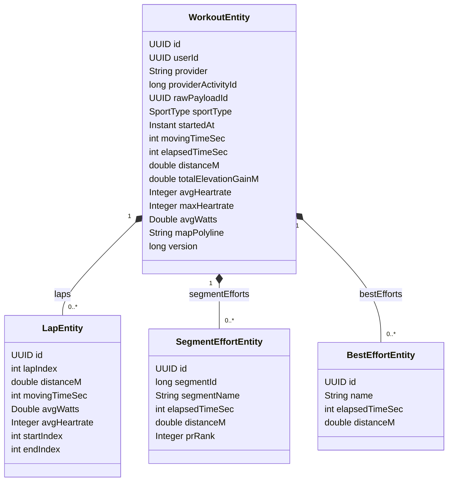

# Workout Catalog — Domain Model

The domain model for the Workout Catalog Bounded Context: the canonical `Workout` aggregate,
its owned collections, the services that build and query it, and the explicit boundary that
keeps per-second telemetry **out** of the relational model.

Style: this is the **one BC where tactical-DDD-flavoured aggregates and the full Hibernate
association toolkit are architecturally correct** — and the model is deliberate about *where*
they are correct and where they are not. Naming follows [conventions/naming.md](../../conventions/naming.md);
layered style per [ADR 0005](../../adr/0005-bounded-contexts.md) (entities are data,
services hold logic — but here the aggregate's *structure* carries real modelling weight).

## Responsibility recap

Catalog turns the raw, Strava-shaped activity that Ingestion archived into the **canonical
`Workout`** — the system's own normalized representation of a training session. Everything
downstream that asks "what workouts did this athlete do?" reads Catalog's model, not Strava's
JSON. Concretely:

1. **Consume `ActivityIngestedEvent`** (from Ingestion), read the referenced
   `RawActivityPayload`, normalize it into a `Workout` aggregate.
2. **Own the canonical training-session schema** — sport type, summary metrics, laps,
   segment efforts, best efforts.
3. **Serve workout reads** to the API and to other BCs' queries.
4. **React to `ActivityDeletedEvent`** by removing/ tombstoning the corresponding `Workout`.

Catalog does **not** compute training load, fitness trends, or power curves — that is
Performance Analytics. Catalog is *structure*; Analytics is *meaning over time*.

## The aggregate boundary — the decision that defines this BC

A Strava activity decomposes into three tiers of data of very different physical scale:

| Tier | Examples | Cardinality per activity | Home |
|---|---|---|---|
| **1 — Summary** | distance, moving time, avg/max HR, elevation, sport, calories | 1 row | `Workout` root |
| **2 — Structured collections** | laps, segment efforts, best efforts | units → low hundreds | `@OneToMany` inside the aggregate |
| **3 — Per-second streams** | heartrate[], watts[], cadence[], velocity[], latlng[], time[] | **10³–10⁴ samples** | **NOT here** — Analytics / TimescaleDB |

**Tiers 1–2 are the `Workout` aggregate. Tier 3 is not in Catalog at all.**

This split is the core engineering judgement of the BC, so it is stated explicitly rather than
left implicit in the schema:

- **Tiers 1–2 are bounded.** Even a long Ironman has a few hundred laps/efforts at most.
  Modelling them as `@OneToMany` is correct: they are *composition* (a lap exists only as part
  of its workout), they benefit from real fetch-strategy choices, and the whole Hibernate
  association toolkit (`@BatchSize`, entity graphs, cascades, `orphanRemoval`, L2 cache) applies
  *legitimately* here. This is the playground — and it is a playground precisely because the
  cardinality makes the tools appropriate, not because we wanted to show them off.

- **Tier 3 is unbounded-ish and has a different access pattern.** 40 000 samples per channel
  per activity, read as whole aligned series for windowed/aggregate computation (power curves,
  zone distribution, CTL/ATL). Modelling that as a JPA `@OneToMany` would be an **anti-pattern**
  (see below). It lives in Performance Analytics' TimescaleDB hypertable, sourced from the same
  `RawActivityPayload`. Catalog never sees it.

### Explicitly rejected: streams as `@OneToMany`

```java
// ❌ NOT how we model streams. Documented as a rejected anti-pattern.
@OneToMany(mappedBy = "workout", cascade = ALL)
private List<StreamSample> samples;   // 40_000 rows for one Ironman
```

Why this is wrong, concretely:
- Hydrating the aggregate drags tens of thousands of rows; every `findById` becomes a landmine.
- `@BatchSize` does **not** help — it addresses N+1 *across* aggregates, not the size of a
  *single* collection. The problem is one giant collection, which batching cannot shrink.
- L2 cache is poisoned: caching a `Workout` means caching 40K samples, blowing the cache budget.
- The access pattern is wrong anyway: nobody loads one workout to read its 40K HR samples
  through an ORM graph; time-series wants columnar/time-partitioned storage and aggregate
  queries, which is exactly what a TimescaleDB hypertable provides.

Demonstrating staff-level judgement includes showing **where a tool was deliberately not used.**
The strong artifact here is the *boundary*, not the maximal pile of associations.

### latlng / GPS — a special case, kept in Catalog as a polyline

The GPS track is technically a tier-3 stream, but its access pattern differs: it is fetched
**whole, to draw a map**, not aggregated in windows. Strava already hands us an **encoded
polyline** string in the activity summary. So the route lives in Catalog as a **plain encoded
string** on the `Workout` (`map_polyline`), not as a relational collection and not in Analytics'
numeric hypertable. One column, read whole, rendered client-side. Numeric per-second streams
(HR/watts/cadence/…) still go to Analytics.

## The `Workout` aggregate



`WorkoutEntity` is the **aggregate root**. The three collections are *composition* (filled
diamond): they have no identity or lifecycle outside their workout.

### Root: `WorkoutEntity`

```java
@Entity
@Table(name = "workouts")
public class WorkoutEntity {
    @Id
    private UUID id;

    private UUID   userId;                 // id-ref to IAM, NO FK, NO association
    private String provider;               // "STRAVA" (TEXT, fwd-compat)
    private long   providerActivityId;     // correlates to Ingestion's payload
    private UUID   rawPayloadId;            // id-ref to Ingestion's RawActivityPayload, NO FK

    @Enumerated(EnumType.STRING)
    private SportType sportType;

    private Instant startedAt;
    private int     movingTimeSec;
    private int     elapsedTimeSec;
    private double  distanceM;
    private double  totalElevationGainM;
    private Integer avgHeartrate;          // nullable — not every activity has HR
    private Integer maxHeartrate;
    private Double  avgWatts;              // nullable — cycling power, often absent
    private String  mapPolyline;          // encoded polyline, whole-read, nullable

    @OneToMany(mappedBy = "workout", cascade = CascadeType.ALL, orphanRemoval = true)
    @BatchSize(size = 50)
    private List<LapEntity> laps = new ArrayList<>();

    @OneToMany(mappedBy = "workout", cascade = CascadeType.ALL, orphanRemoval = true)
    @BatchSize(size = 50)
    private List<SegmentEffortEntity> segmentEfforts = new ArrayList<>();

    @OneToMany(mappedBy = "workout", cascade = CascadeType.ALL, orphanRemoval = true)
    @BatchSize(size = 50)
    private List<BestEffortEntity> bestEfforts = new ArrayList<>();

    @Version
    private long version;

    @CreationTimestamp private Instant createdAt;
    @UpdateTimestamp   private Instant updatedAt;
}
```

The Hibernate toolkit, and **why each piece is right here** (not cargo-culted):

- **`@OneToMany(mappedBy=...)`** — bidirectional, child owns the FK (`workout_id`). Standard
  composition mapping; the parent's `mappedBy` avoids the extra join table or update statement
  an unidirectional `@OneToMany` would incur.
- **`cascade = ALL` + `orphanRemoval = true`** — laps live and die with their workout. Persist
  the workout → laps persist; remove a lap from the list → it is deleted; delete the workout →
  laps cascade-delete. This is the textbook-correct cascade for true composition, and it is
  correct *because* the boundary is correct: nothing outside the aggregate references a lap.
- **`@BatchSize(size = 50)`** — solves N+1 on the **list** read. Loading 30 workouts for a
  feed, each with lazy `laps`, would fire 30 extra selects; `@BatchSize` collapses them into
  `ceil(30/50)=1` `IN (...)` query. This is exactly the situation `@BatchSize` is *for* — many
  aggregates, small bounded child collections — which is why it is meaningless on tier-3 and
  meaningful here.
- **`@Version`** — optimistic locking on the root. An `update`-aspect re-ingestion of the same
  activity (Strava lets athletes edit activities) races against nothing usually, but the version
  guards a concurrent re-normalization and is the aggregate's consistency boundary.
- **Default `LAZY`** on all collections — a summary/feed read never pays for laps it doesn't
  show. Detail reads opt in via an **entity graph** (see api/database), not by switching to EAGER.

### Children

`LapEntity`, `SegmentEffortEntity`, `BestEffortEntity` each carry `@ManyToOne WorkoutEntity
workout` (the FK owner) plus their own fields. They are entities (have identity, are rows) but
have **no behaviour** and **no meaning outside the aggregate** — pure structural composition.

`SegmentEffortEntity.segmentId` is a **plain `long` id-reference** to Strava's global segment,
**not** a JPA association to a `Segment` entity. We do not model `Segment` as its own aggregate
in MVP: a segment is a globally-shared Strava concept (thousands of athletes ride the same
segment), and we only need the effort *as part of this workout*. Crossing into a shared
`Segment` aggregate via `@ManyToOne` would violate the project rule "no JPA associations across
aggregate boundaries" ([JPA policy](#persistence-policy)). If segment leaderboards ever become a
feature, `Segment` becomes its own aggregate then, referenced by id — additive, not a rework.

## SportType

```java
public enum SportType {
    RUN, TRAIL_RUN, RIDE, GRAVEL_RIDE, MOUNTAIN_BIKE, SWIM,
    OPEN_WATER_SWIM, WORKOUT, HIKE, WALK, OTHER
}
```

Strava's `sport_type` vocabulary mapped onto ours. Unknown/unsupported Strava values map to
`OTHER` rather than failing normalization — same defensive posture as Ingestion keeping
Strava's vocabulary as strings. Stored `TEXT` via `@Enumerated(EnumType.STRING)`.

## Services

| Service | Responsibility |
|---|---|
| `ActivityNormalizationService` | consumes `ActivityIngestedEvent`, reads `RawActivityPayload`, builds & persists the `Workout` aggregate, emits `WorkoutCreatedEvent` / `WorkoutUpdatedEvent` |
| `WorkoutQueryService` | read side — single workout (with entity graph for detail), paged feed (summary projection), by-sport / by-date filters |
| `WorkoutDeletionService` | consumes `ActivityDeletedEvent`, removes/tombstones the `Workout`, emits `WorkoutDeletedEvent` |

Normalization is the heart of the BC: it is the anti-corruption translation from Strava's
shape to ours. Crucially it reads the **archived** payload (`rawPayloadId`), not Strava live —
Ingestion already paid the API cost; Catalog re-normalizes from the archive, which also means
a normalization bug can be **fixed and replayed** over stored payloads without re-hitting Strava.

## Persistence policy — Hibernate use in Catalog

This is the BC where the association toolkit is **on**, *within* the aggregate:

| Feature | Used? | Where / why |
|---|---|---|
| `@OneToMany` / `@ManyToOne` | ✅ | root ↔ laps/efforts, *inside* the aggregate only |
| `@BatchSize` | ✅ | N+1 control on feed reads |
| Entity graphs | ✅ | opt-in eager detail fetch (`Workout` + laps in one query) |
| `cascade=ALL`, `orphanRemoval` | ✅ | composition lifecycle of children |
| `@Version` optimistic locking | ✅ | aggregate root consistency |
| L2 cache | ◑ | candidate for hot read-mostly workouts; evaluated, not auto-on (see database.md) |
| Associations **across** aggregates | ❌ | `userId`, `rawPayloadId`, `segmentId` are plain id-refs, no FK, navigate via repo/event |

The rule from the rest of the project still holds at the **boundary**: no JPA association ever
crosses an aggregate or a BC. What changes in Catalog is that there is now real structure
*inside* an aggregate, and that interior is where the toolkit legitimately lives.

## Invariants

1. **One `Workout` per `(provider, providerActivityId)`.** The canonical activity is ingested
   once; re-delivery/re-normalization updates in place. DB unique constraint.
2. **Children belong to exactly one workout.** Composition; enforced by the FK + `orphanRemoval`.
3. **No tier-3 data in this BC.** No per-second sample tables. Architecturally enforced by the
   schema (there is no such table) and by `ApplicationModules.verify()` (no dependency on
   Analytics' internals).
4. **No JPA association crosses the aggregate or BC boundary.** `userId`/`rawPayloadId`/
   `segmentId` are id-refs. Enforced by an architecture test on the field types.
5. **Normalization is replayable.** A `Workout` is a pure function of its `RawActivityPayload`;
   re-running normalization over the archive reproduces it (modulo schema evolution).

## Collaboration summary

```
ActivityIngestedEvent (Ingestion) → ActivityNormalizationService
    → reads RawActivityPayload (by rawPayloadId, via Ingestion's published read interface)
    → builds WorkoutEntity (+ laps, efforts) → WorkoutRepository
    → publishes WorkoutCreatedEvent / WorkoutUpdatedEvent
ActivityDeletedEvent (Ingestion) → WorkoutDeletionService → publishes WorkoutDeletedEvent
WorkoutQueryService → WorkoutRepository (feed projections, entity-graph detail)
```

## Next documents in this BC

- [database.md](database.md) — DDL, indexes, the entity-graph & fetch-plan specifics, L2 cache
- [events.md](events.md) — `WorkoutCreated/Updated/Deleted` payloads; consumed `ActivityIngested/Deleted`
- [api.md](api.md) — workout read endpoints (feed, detail), projections
- Sequence diagram: `diagrams/sequence/activity-normalization.md`
