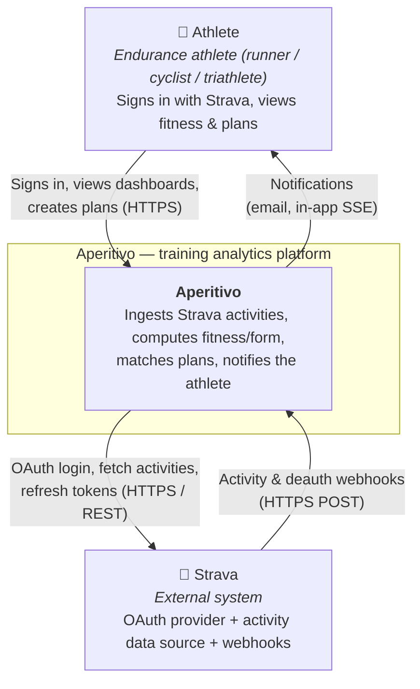

# C4 Level 1 — System Context

Aperitivo as a black box, surrounded by the people who use it and the external systems it depends
on. This is the highest-level view: *who* uses the system and *what* it talks to, with no internal
detail. C4 model: [c4model.com](https://c4model.com/). Conventions:
[diagrams-README](../../contexts/identity-access/diagrams/diagrams-README.md).

## What this shows

The system's place in the world: one type of user (the athlete), one external dependency (Strava),
and the two channels between Aperitivo and Strava (OAuth + REST, and webhooks). Everything inside
the Aperitivo box is deferred to [Level 2 — Containers](level-2-containers.md).

## Diagram



## The relationships

| From | To | Nature |
|---|---|---|
| Athlete → Aperitivo | HTTPS (browser/app) | sign in via Strava, view fitness/form/PRs, author training plans |
| Aperitivo → Strava | OAuth 2.0 + REST | login, fetch activity detail & streams, refresh tokens — all **server-to-server** (confidential client) |
| Strava → Aperitivo | Webhooks (HTTPS POST) | realtime activity create/update/delete + athlete deauthorization |
| Aperitivo → Athlete | Email + SSE | PR notifications, session reminders, reconnect prompts |

## Key facts at this level

- **One external dependency.** Strava is the *single point of dependency* — if Strava revokes API
  access or changes terms, the product is non-functional. An accepted risk for a portfolio project
  ([architecture overview](../../architecture/overview.md)).
- **Two Strava channels, deliberately distinct.** The OAuth/REST channel (we initiate) and the
  webhook channel (Strava initiates) are owned by different internal contexts — a distinction that
  becomes visible at Level 2/3 ([IAM domain-model](../../contexts/identity-access/domain-model.md)).
- **One user type in MVP.** The athlete. No coach/admin/multi-tenant roles yet (post-MVP).
- **Aperitivo issues its own identity.** Although login is via Strava OAuth, Aperitivo mints its own
  JWT — there is no external identity server in the picture
  ([ADR 0009](../../adr/0009-identity-spring-security.md)). At this level that's invisible; it
  surfaces at Level 2.

## Not shown here (deferred to lower levels)

- Internal structure (the modular monolith, its BCs) → [Level 2](level-2-containers.md).
- Backing services (Postgres, Redis, observability) → [Level 2](level-2-containers.md).
- The six Bounded Contexts and their interactions → [Level 3](level-3-components.md).
- Future providers (Garmin, Wahoo, …) — not in MVP; would appear as additional external systems
  alongside Strava ([ADR 0004](../../adr/0004-user-model-and-connected-sources.md)).

## Related

- [Level 2 — Containers](level-2-containers.md)
- [Level 3 — Components](level-3-components.md)
- [architecture overview](../../architecture/overview.md)
```
