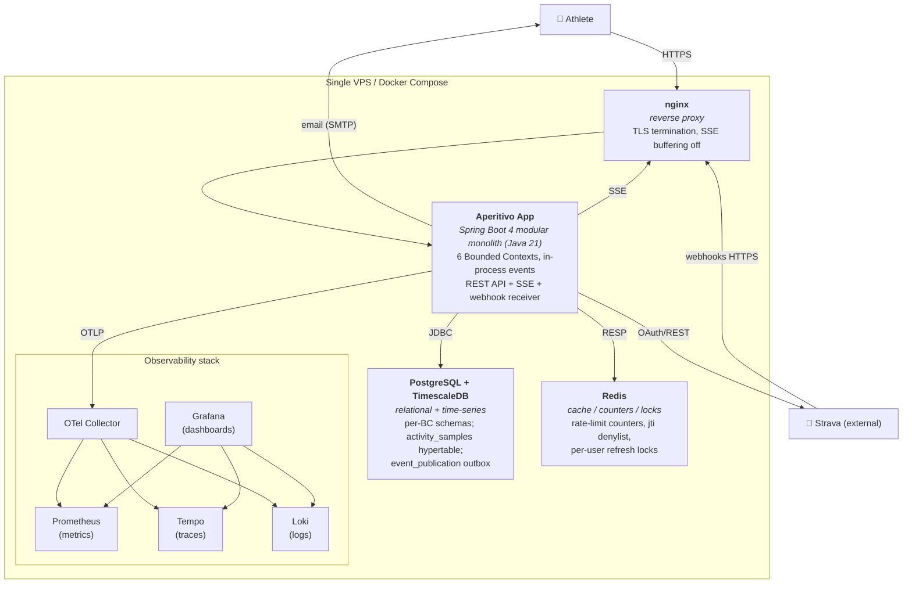

# C4 Level 2 — Containers

The internal high-level deployment units of Aperitivo: the modular-monolith application and its
backing services. One level down from [System Context](level-1-system-context.md) — it opens the
Aperitivo box to show the *containers* (separately-runnable/deployable things), but not yet the
Bounded Contexts inside the app ([Level 3](level-3-components.md)).

C4 model: [c4model.com](https://c4model.com/). Deployment detail:
[deployment.md](../../operations/deployment.md).

## What this shows

Aperitivo is a **single application container** (the modular monolith) plus its datastores and the
observability stack — all on one host via Docker Compose for the MVP. The notable point: the app is
*one* deployable, not six services, even though it contains six Bounded Contexts (those are a
build-time/logical boundary, not separate containers —
[spring-modulith-boundaries.md](../../technical-notes/spring-modulith-boundaries.md)).

## Diagram



## The containers

| Container | Tech | Responsibility |
|---|---|---|
| **nginx** | reverse proxy | TLS termination; SSE buffering off (`X-Accel-Buffering: no`); fronts the webhook callback |
| **Aperitivo App** | Spring Boot 4, Java 21, Spring Modulith | the whole application — all six BCs, in-process events, REST + SSE + webhook receiver. One deployable |
| **PostgreSQL + TimescaleDB** | Postgres + extension | per-BC schemas in one instance; Analytics' `activity_samples` hypertable; the `event_publication` outbox |
| **Redis** | Redis | rate-limit counters, `jti` denylist, per-user refresh locks — the *multi-instance-ready* state |
| **OTel Collector + Prometheus + Tempo + Loki + Grafana** | OSS observability | metrics, traces, logs, dashboards ([observability.md](../../operations/observability.md)) |

## Key facts at this level

- **One app container, six BCs.** The Bounded Contexts are *logical* modules with build-time-enforced
  boundaries ([spring-modulith-boundaries.md](../../technical-notes/spring-modulith-boundaries.md)),
  not separate deployables. "Deploy" = one container restart. Extraction to services later is
  mechanical (no cross-BC FKs) — but explicitly not MVP.
- **One Postgres, many schemas.** All BCs share one Postgres instance with per-BC schemas + the
  TimescaleDB extension for Analytics. Logical separation, operational simplicity
  ([ADR 0005](../../adr/0005-bounded-contexts.md)).
- **No message broker.** Inter-BC events are in-process via the `event_publication` outbox in Postgres
  — no Kafka container ([ADR 0008](../../adr/0008-event-transport.md),
  [idempotency-and-outbox.md](../../technical-notes/idempotency-and-outbox.md)).
- **Redis holds the multi-instance-ready state.** Rate-limit counters, denylist, and locks live in
  Redis precisely so they're correct across instances — which is why horizontal scaling is gated only
  by the in-memory SSE registry, not these ([deployment.md](../../operations/deployment.md)).
- **No identity-server container.** Identity is in-app (Spring Security + own JWT) — no Keycloak
  ([ADR 0009](../../adr/0009-identity-spring-security.md)).

## Not shown here (deferred)

- The six BCs *inside* the app container and how they interact → [Level 3](level-3-components.md).
- Future scaling topology (multiple app instances, read replica, broker) — deferred
  ([deployment.md](../../operations/deployment.md)).

## Related

- [Level 1 — System Context](level-1-system-context.md)
- [Level 3 — Components](level-3-components.md)
- [deployment.md](../../operations/deployment.md), [observability.md](../../operations/observability.md)
- [architecture overview](../../architecture/overview.md)
```
