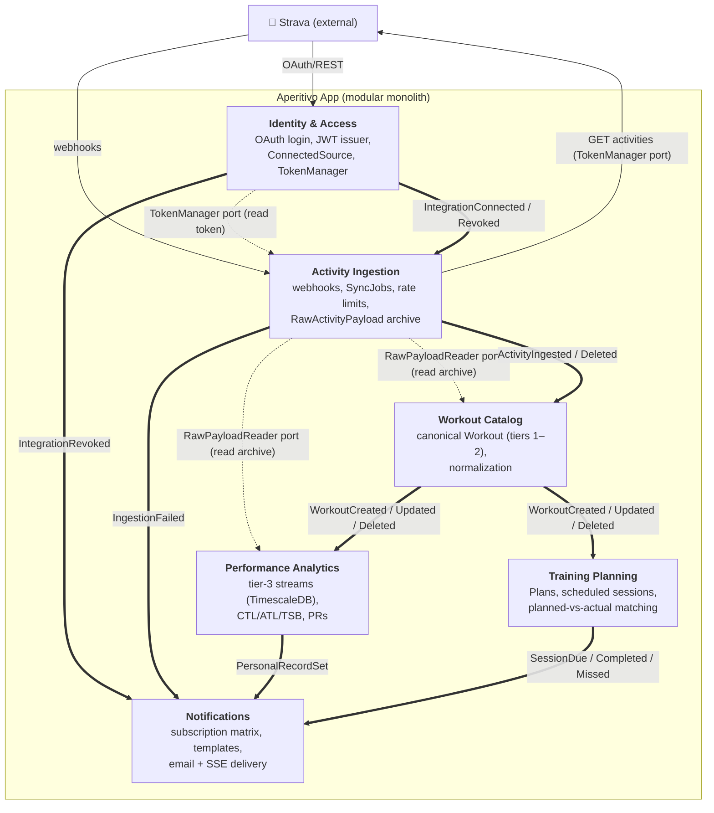

# C4 Level 3 — Components

The six Bounded Contexts inside the Aperitivo application container, and how they relate — events
(asynchronous) and published ports (synchronous reads). One level down from
[Containers](level-2-containers.md): it opens the app box to show its internal modules. C4 model:
[c4model.com](https://c4model.com/).

We do **not** maintain Level 4 (Code) — source is the authoritative artifact there
([diagrams-README](../../contexts/identity-access/diagrams/diagrams-README.md)).

## What this shows

The six BCs as components, the **events** that flow between them (the asynchronous backbone), and the
two **published ports** (synchronous in-process reads). This is the same decomposition as the
[bounded-contexts overview](../../architecture/bounded-contexts.md) and the
[event catalog](../../events/catalog.md), drawn as a component view.

## Diagram



Legend: **`==>`** = asynchronous domain event (Modulith, after commit). **`-.->`** = synchronous
in-process published port (a read). Solid arrows to/from Strava = external HTTP.

## The components

| Component (BC) | Role | Owns |
|---|---|---|
| **Identity & Access** | identity + credentials | User, ConnectedSource, TokenManager, JWT issuer |
| **Activity Ingestion** | anti-corruption layer to Strava | WebhookEvent, SyncJob, RawActivityPayload, SyncState |
| **Workout Catalog** | canonical workout structure (tiers 1–2) | Workout aggregate (laps/efforts), normalization |
| **Performance Analytics** | tier-3 + derived metrics | activity_samples hypertable, CTL/ATL/TSB, PRs, curves |
| **Training Planning** | intended training + reconciliation | Plan/ScheduledSession/PlannedTarget, matching engine |
| **Notifications** | downstream sink → users | preferences, templates, delivery (email/SSE) |

## The two interaction styles

**Asynchronous — domain events** (the backbone). One BC publishes a past-tense fact; others consume
after commit. This is most inter-BC flow. The full contracts are in the
[event catalog](../../events/catalog.md); the dependency graph is **acyclic** and enforced by
`ApplicationModules.verify()` ([spring-modulith-boundaries.md](../../technical-notes/spring-modulith-boundaries.md)).

**Synchronous — published ports** (narrow reads). Two only:
- **IAM's `TokenManager`** — Ingestion's sole synchronous reach into IAM, for hot-path token access.
- **Ingestion's `RawPayloadReader`** — how Catalog and Analytics read the archived payload (by
  `rawPayloadId`) without HTTP.

Everything else is an event. There is **no** cross-BC database read and **no** JPA association across
a boundary — those are id-refs, enforced at build time.

## Key facts at this level

- **Notifications is a pure sink; IAM is a pure source.** Notifications consumes from everyone and is
  consumed by no one; IAM originates identity. No cycles.
- **Catalog ↔ Analytics is the deliberate counterweight pair.** Catalog is the association playground
  (rich aggregate); Analytics is bulk-insert time-series + flat CRUD — same project, opposite
  toolkit ([Catalog](../../contexts/workout-catalog/domain-model.md),
  [Analytics](../../contexts/performance-analytics/domain-model.md)).
- **Planning has no Analytics dependency in MVP.** The TSS decoupling means Planning's matching reads
  no Analytics data — it consumes only Catalog's workout events
  ([Planning domain-model](../../contexts/training-planning/domain-model.md)).
- **The whole event chain is one trace.** Because events are in-process, a single `trace_id`
  propagates from webhook to fitness chart — visible in one Tempo trace
  ([observability.md](../../operations/observability.md)).

## Generating this from code

Spring Modulith's `Documenter` (`new Documenter(modules).writeModulesAsPlantUml()`) generates module
and component diagrams **from the actual code structure**, so this view can be kept honest against
reality rather than drifting — a build-time-derived companion to this hand-authored Mermaid version
([spring-modulith-boundaries.md](../../technical-notes/spring-modulith-boundaries.md)).

## Related

- [Level 1 — System Context](level-1-system-context.md), [Level 2 — Containers](level-2-containers.md)
- [bounded-contexts overview](../../architecture/bounded-contexts.md) — the same decomposition in prose
- [event catalog](../../events/catalog.md) — the full event contracts
- [spring-modulith-boundaries.md](../../technical-notes/spring-modulith-boundaries.md) — boundary enforcement + Documenter
```
