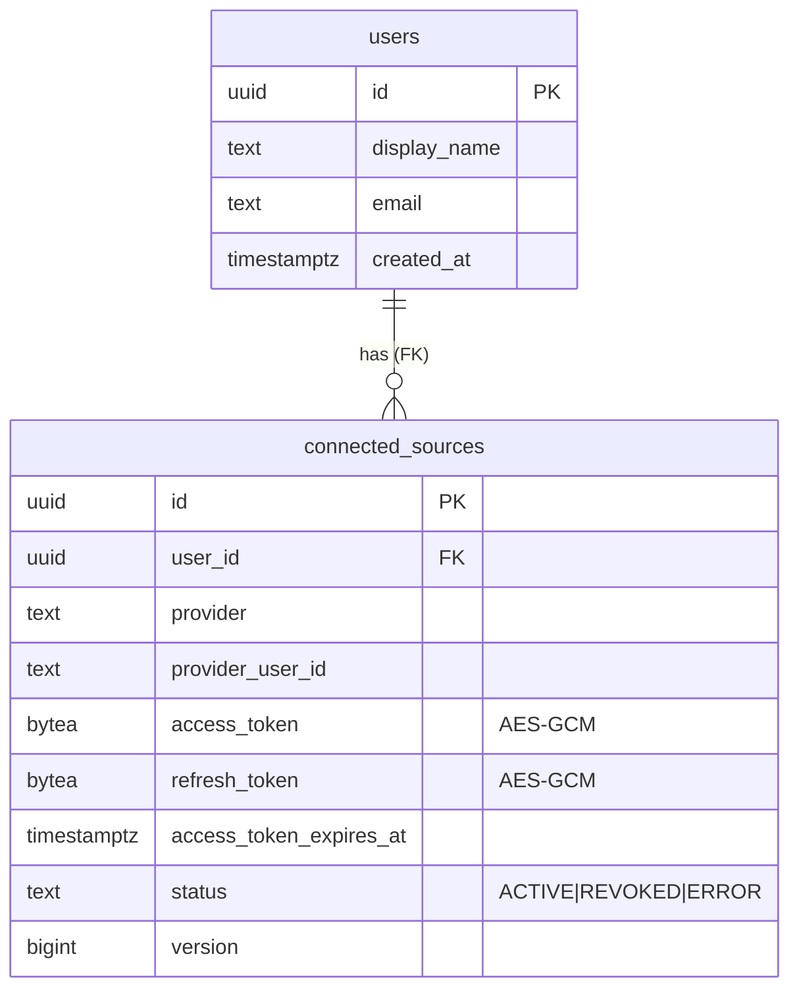
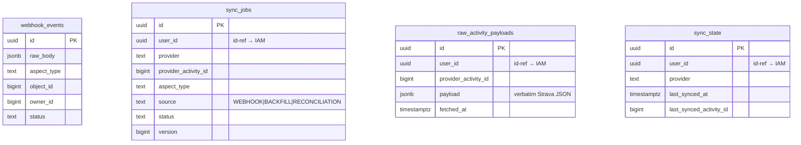
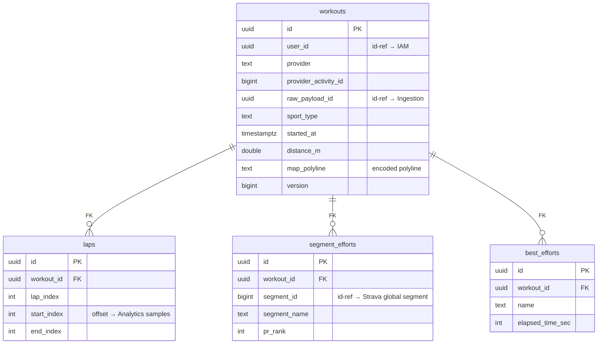
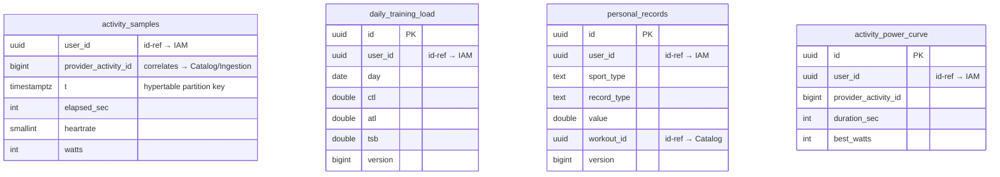
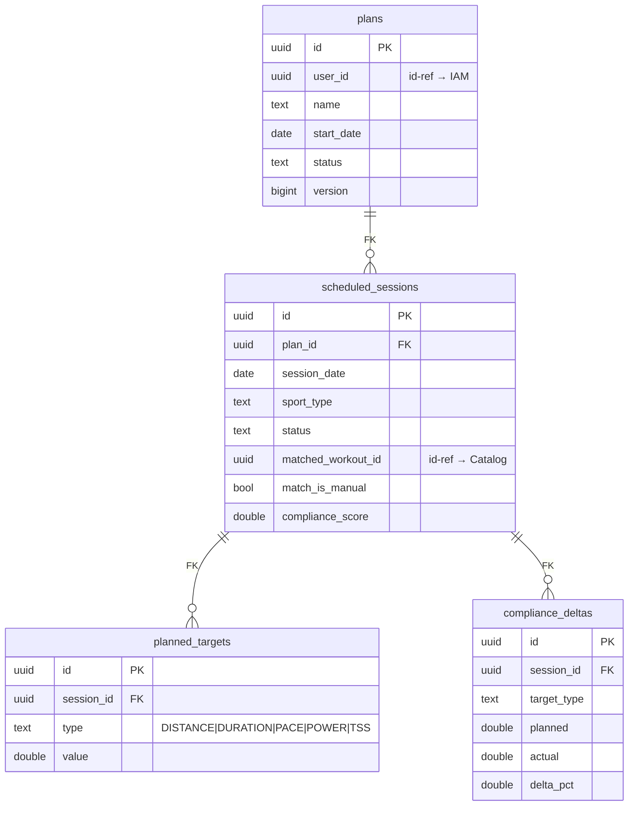
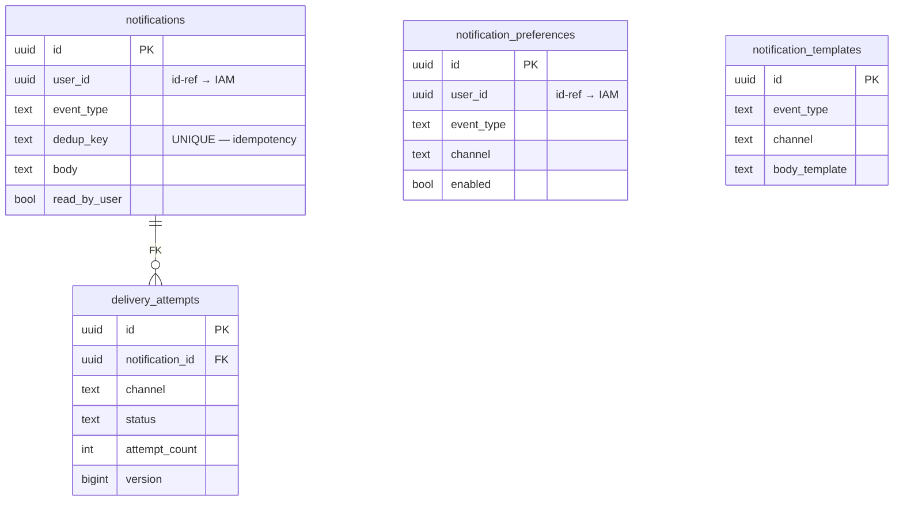

# Cross-BC Entity-Relationship Overview

The entity map across all six Bounded Contexts, drawn to make **the central architectural
distinction** visible: **real foreign keys exist only *within* a BC/aggregate; references *across*
BC boundaries are plain id-columns with no FK.** Per-BC schemas are detailed in each `database.md`;
this is the consolidated, boundary-aware view.

C4/diagram conventions: [diagrams-README](../../contexts/identity-access/diagrams/diagrams-README.md).
Rationale for the no-cross-BC-FK rule: [ADR 0005](../../adr/0005-bounded-contexts.md).

## How to read this

- **Solid relationships (`||--o{`)** are **real database foreign keys** — they exist only between
  tables in the **same** BC (within an aggregate). Postgres enforces them.
- **Dashed annotations / the "id-ref" table below** are **cross-BC references** — a plain
  `UUID`/`BIGINT` column pointing at another BC's row, with **no** FK. Referential integrity across
  a boundary is the *application's* job, enforced by events + idempotency, not the schema. This is
  what makes future extraction to separate databases mechanical
  ([spring-modulith-boundaries.md](../../technical-notes/spring-modulith-boundaries.md)).

Mermaid `erDiagram` can only draw relationships it treats as FKs, so to avoid implying cross-BC FKs
that don't exist, **each BC is drawn as its own diagram** (intra-BC FKs only), and cross-BC
references are tabulated separately below.

## Identity & Access



The **one** intra-BC FK here: `connected_sources.user_id → users.id` (both IAM-owned).

## Activity Ingestion



Notably **no intra-BC FKs** — the four tables have independent lifecycles and correlate by
`(provider, provider_activity_id)`, not joins ([Ingestion database](../../contexts/activity-ingestion/database.md)).
`webhook_events` deliberately has no unique constraint (duplicate deliveries = duplicate rows; dedup
is on `sync_jobs`).

## Workout Catalog



The `workouts → laps/segment_efforts/best_efforts` FKs are the **aggregate composition** — all
Catalog-owned, so real FKs with `ON DELETE CASCADE`. `lap.start_index/end_index` are integer
**offsets** into Analytics' samples, not a FK ([Catalog database](../../contexts/workout-catalog/database.md)).

## Performance Analytics



**No FKs at all** — `activity_samples` is a TimescaleDB hypertable (bulk insert), the derived tables
are flat. Even hypertable ↔ derived-table is by value (`provider_activity_id`), because their
lifecycles differ (samples may be compressed/retention-dropped while metrics persist)
([Analytics database](../../contexts/performance-analytics/database.md)).

## Training Planning



The `plans → scheduled_sessions → planned_targets/compliance_deltas` FKs are the aggregate
composition (all Planning-owned). `matched_workout_id` is an id-ref to Catalog, not a FK
([Planning database](../../contexts/training-planning/database.md)).

## Notifications



The one intra-BC FK: `delivery_attempts.notification_id → notifications.id` (both
Notifications-owned). `notifications.dedup_key` is the idempotency anchor
([Notifications database](../../contexts/notifications/database.md)).

## Cross-BC references (the id-refs — NO foreign keys)

Every reference that crosses a BC boundary, all plain id-columns:

| From (table.column) | → To (BC.table.id) | Type | How integrity is kept |
|---|---|---|---|
| `ingestion.sync_jobs.user_id` | IAM `users.id` | UUID | app-level; TokenManager call |
| `ingestion.raw_activity_payloads.user_id` | IAM `users.id` | UUID | app-level |
| `ingestion.sync_state.user_id` | IAM `users.id` | UUID | app-level |
| `catalog.workouts.user_id` | IAM `users.id` | UUID | app-level |
| `catalog.workouts.raw_payload_id` | Ingestion `raw_activity_payloads.id` | UUID | event carries it; `RawPayloadReader` port |
| `catalog.segment_efforts.segment_id` | Strava global segment | BIGINT | external; no Segment aggregate in MVP |
| `analytics.*.user_id` | IAM `users.id` | UUID | app-level |
| `analytics.personal_records.workout_id` | Catalog `workouts.id` | UUID | event-carried |
| `planning.plans.user_id` | IAM `users.id` | UUID | app-level |
| `planning.scheduled_sessions.matched_workout_id` | Catalog `workouts.id` | UUID | matching engine |
| `notifications.*.user_id` | IAM `users.id` | UUID | app-level |
| `(catalog.laps.start_index/end_index)` | Analytics `activity_samples` offset | INT | correlate by `(providerActivityId, index)` |

The recurring spine is **`user_id`** — every BC references the IAM user by id, none with a FK. That
single fact is what lets any BC be extracted to its own database without untangling foreign keys
([ADR 0005](../../adr/0005-bounded-contexts.md)).

## Why this matters (the architectural payoff)

- **Extraction-ready.** No cross-BC FK means a BC's tables can move to a separate database with zero
  schema surgery — only the (already id-ref) application code changes.
- **The boundary is provable.** `ApplicationModules.verify()` enforces that no BC reads another's
  tables; this ERD is the data-layer picture of that enforcement
  ([spring-modulith-boundaries.md](../../technical-notes/spring-modulith-boundaries.md)).
- **Aggregates are real where it counts.** Within Catalog and Planning, the composition FKs
  (`ON DELETE CASCADE`) make the aggregate a true unit — the association playground is genuine,
  not cosmetic ([Catalog](../../contexts/workout-catalog/domain-model.md),
  [Planning](../../contexts/training-planning/domain-model.md)).

## Related

- Each BC's `database.md` for full DDL, constraints, indexes
- [bounded-contexts overview](../../architecture/bounded-contexts.md), [C4 Level 3](../c4/level-3-components.md)
- [ADR 0005](../../adr/0005-bounded-contexts.md), [spring-modulith-boundaries.md](../../technical-notes/spring-modulith-boundaries.md)
```
