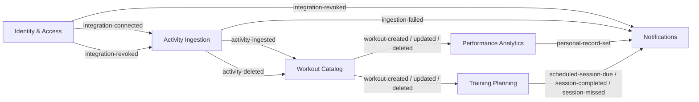

# Event Catalog

This is the canonical catalog of all **domain events** that flow between Bounded Contexts in Aperitivo. It is the single source of truth for event names, ownership, payload contracts, and consumer relationships.

Events are delivered **in-process** via Spring Modulith application events (persisted in `event_publication`, published after commit). There is no message broker in the MVP — see [ADR 0008](../adr/0008-event-transport.md). The events are nonetheless designed to be **broker-ready**: past-tense names, explicit versioning, and `user_id` in every payload (the natural partition key if they are ever externalized).

> **Status: populated from per-BC event-storming.** The per-BC deep dives (`contexts/{bc}/events.md`) are the authoritative contract for each event's full payload and emit conditions; this catalog is the cross-BC index that mirrors them. Where this catalog and a BC's `events.md` ever disagree, the BC's `events.md` wins and this file is the bug.

## Conventions

See [conventions.md](conventions.md) for the full set. In brief:

- **Past tense, domain language.** `WorkoutCreated`, not `CreateWorkout`; `IntegrationRevoked`, not `StravaTokenInvalidated`.
- **Logical name ↔ Java type.** Each event has a kebab-case logical name with a version suffix (`workout-created.v1`) and a corresponding Java record type with an `Event` suffix (`WorkoutCreatedEvent`). The two refer to the same contract; this catalog lists the logical name, the BC `events.md` files show the record.
- **Versioned contracts.** Each event has a contract version; backward-compatible changes keep the version, breaking changes bump it.
- **One publishing BC per event.** Any BC may consume. A BC consuming its own events is a smell.
- **At-least-once semantics in spirit.** Even in-process, delivery is treated as at-least-once; consumers are idempotent on a natural business key in the payload (no synthetic `eventId` in MVP — see [conventions.md](conventions.md) and each BC's `events.md`), so that externalizing to a broker later requires no rework.

## Event index

### Published by Identity & Access

| Logical name | Java type | Version | Triggered by | Consumed by |
|---|---|---|---|---|
| `user-registered` | `UserRegisteredEvent` | v1 | First Strava sign-up | (future: analytics) |
| `integration-connected` | `IntegrationConnectedEvent` | v1 | New ConnectedSource becomes ACTIVE | Activity Ingestion (kicks off backfill) |
| `integration-revoked` | `IntegrationRevokedEvent` | v1 | Token rejected by Strava, or deauth webhook | Activity Ingestion (cancel jobs), Notifications |

Full contracts: [identity-access/events.md](../contexts/identity-access/events.md).

### Published by Activity Ingestion

| Logical name | Java type | Version | Triggered by | Consumed by |
|---|---|---|---|---|
| `activity-ingested` | `ActivityIngestedEvent` | v1 | Successful sync of one activity (create/update; `aspectType` field) | Workout Catalog |
| `activity-deleted` | `ActivityDeletedEvent` | v1 | Strava notified of deletion | Workout Catalog |
| `ingestion-failed` | `IngestionFailedEvent` | v1 | Sync job exhausted retries | Notifications |

Full contracts: [activity-ingestion/events.md](../contexts/activity-ingestion/events.md).

> Note: Ingestion deliberately **merges** create/update into one `activity-ingested` event carrying an `aspectType` field — to Ingestion both are "fetch and archive a payload". Catalog, downstream, **splits** them (below), because its consumers react differently. The two opposite choices are intentional and documented in each BC's `events.md`.

### Published by Workout Catalog

| Logical name | Java type | Version | Triggered by | Consumed by |
|---|---|---|---|---|
| `workout-created` | `WorkoutCreatedEvent` | v1 | New canonical Workout normalized from a `create` aspect | Performance Analytics, Training Planning |
| `workout-updated` | `WorkoutUpdatedEvent` | v1 | Existing Workout re-normalized from an `update` aspect | Performance Analytics, Training Planning |
| `workout-deleted` | `WorkoutDeletedEvent` | v1 | Activity deletion processed | Performance Analytics, Training Planning |

Full contracts: [workout-catalog/events.md](../contexts/workout-catalog/events.md).

> Catalog splits `created`/`updated`/`deleted` into three events (unlike Ingestion's merged one) because downstream **reactions differ**: Analytics folds new load in on `created`, recomputes forward on `updated`/`deleted`. Planning matches on `created`, re-evaluates on `updated`/`deleted`.

### Published by Performance Analytics

| Logical name | Java type | Version | Triggered by | Consumed by |
|---|---|---|---|---|
| `personal-record-set` | `PersonalRecordSetEvent` | v1 | A new personal best was achieved (PR row set or beaten) | Notifications |

Full contracts: [performance-analytics/events.md](../contexts/performance-analytics/events.md).

> Analytics publishes **only** this one event. Continuous derived state (CTL/ATL/TSB, power curves, stream slices) is **read via the API**, not broadcast — it changes on essentially every workout and has no discrete "fact happened" worth an event. A PR is a discrete, celebratory fact with a clear consumer, so it is the one thing emitted. (Earlier drafts listed `MetricsRecomputed` and `TrendDetected`; both were dropped — `MetricsRecomputed` because continuous state is queried not broadcast, `TrendDetected` because multi-week trend detection is post-MVP and would be added as a new event then.)

### Published by Training Planning

*Contracts pending the Planning BC deep-dive. The shape below is the obverse design from the architecture overview and is subject to revision when `contexts/training-planning/events.md` is written.*

| Logical name | Java type | Version | Triggered by | Consumed by |
|---|---|---|---|---|
| `scheduled-session-due` | `ScheduledSessionDueEvent` | v1 | Scheduled time approached | Notifications |
| `session-completed` | `SessionCompletedEvent` | v1 | Match found between plan and workout | Notifications |
| `session-missed` | `SessionMissedEvent` | v1 | No match within window | Notifications |

### Published by Notifications

*Contracts pending the Notifications BC deep-dive.*

| Logical name | Java type | Version | Triggered by | Consumed by |
|---|---|---|---|---|
| `notification-delivered` | `NotificationDeliveredEvent` | v1 | Successful delivery | (future: analytics) |
| `notification-failed` | `NotificationFailedEvent` | v1 | Permanent delivery failure | (future: alerting) |

---

## Cross-BC event flow (current, MVP)



---

## Common envelope

If events are ever externalized to a broker, they take this wire envelope. In-process today there is **no** separate envelope object — the published Java record carries the domain-meaningful fields, and the rest is derived at the externalization boundary (see each BC's `events.md` under "externalization envelope").

```json
{
  "event_id": "uuid",
  "event_type": "workout-created",
  "event_version": "v1",
  "occurred_at": "ISO-8601 timestamp",
  "producer": "workout-catalog",
  "trace_id": "for OTel correlation",
  "user_id": "uuid (partition key if ever externalized)",
  "data": { /* event-specific payload */ }
}
```

The `user_id` in the envelope is the Aperitivo internal UUID, not a provider-specific ID. Note that in MVP the Java records do **not** carry a synthetic `event_id` field — identity is owned by Spring Modulith's `event_publication` row, and consumers dedup on natural business keys. The `event_id` above is part of the *externalization* contract, added only if/when events go to a broker (a backward-compatible change). See [conventions.md](conventions.md).
